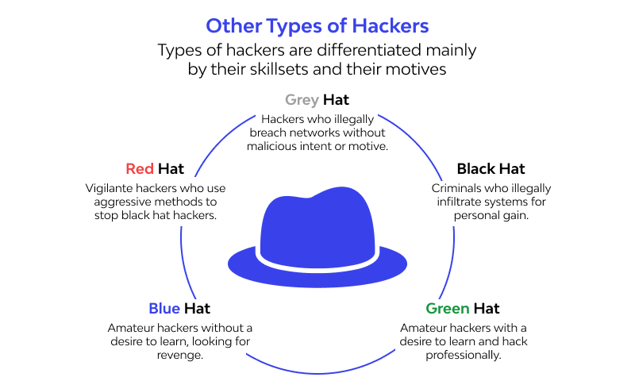
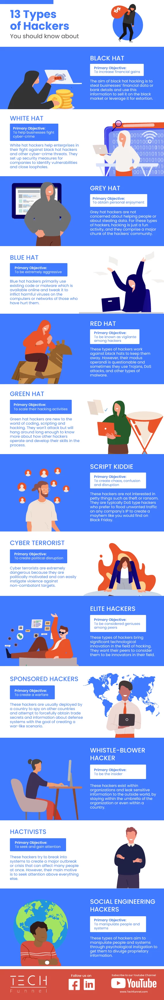

# Basic network security concepts

## What is security?

Security is an ongoing process to protect assets.

It is a process because you can NOT buy a miracle device or software to protect 100% an asset forever.

## Crackers
A cracker is an individual who attempts to access computer systems **without authorization**. These individuals are often malicious, as opposed to hackers, and have many means at their disposal for breaking into a system.

## Hackers

This term is often misused in a pejorative context, however, the correct usage of this word is to describe a person who delights in having an intimate understanding of the internal workings of a system, computers and computer networks in particular.

Although there is a strick distinction between hacker and cracker, some sub-categories are commonly used for the term hacker:

- **Black hat hacker**: An individual who has malicious intentions and exploit security flaws **without** authorization. Usually motivated by money.
- **Gray hat hacker**: An individual who exploits security flaws without authorization but report them immediately to the owner/company without taking advantage or exposing the flaw to the public.
- **White hat hacker**: Individuals who have authorized access to find and exploit vulnerabilities, usually they are hired to perform these tasks and create reports to improve the security.

Some people like to add more sub categories: green hat hacker and blue hat hacker:

Another common terms used when describing malicious individuals are:

- **Script kiddies**: these are unprofessional individuals who perform attacks using instructions found on Internet, videos, etc. Although they knowledge is poor, they can cause serious damage.
- **State sponsored hacker**: individuals sponsored by countries, government, etc. to attack other cities, countries, etc. to stole information, make service disruptions, etc.
- **Cyber terrorist**: Similar to state sponsored hackers, these are individuals who may or may not be sponsored to attack a country or city motivated by religious or political beliefs.
- **Hacktivist**: Individuals who promote a political agenda by hacking, especially defacing (edit a web page to display different content) or disabling websites.

## Threats

Network include internal and external threads:

### Internal/insider threats:

An insider is any person who has or had authorized access to or knowledge of an organization’s resources, including personnel, facilities, information, equipment, networks, and systems.

### External threats:

External threats are any external agents that can cause damage to internal assets.

Some common attacks are:

- **Zero-day attacks**: This attack occurs when a malicious agent exploit or takes advantage of a vulnerability on the first day it became known.
- **DOS**: Denial of Service is designed to slow or crash applications, processes or services so they become unavailable.
- **DDOS**: Distributed Denial of Service is an organized DOS carried out by dozen, hundred, thousand, etc. computers that exploit a vulnerability in a service, make a lot of request thus consuming all resources, etc. to slow or crash an application or process. Usually this attack is done by infected computers that perform the malicious tasks, these computers create a big network called **botnet**, the computers, or bots are zombies that execute the attack. You computer may be infected right now.
- **Identity theft**: an attack to steal login credentials in order to access private data.
- **Data interception and theft**: an attacker capture private data by intercepting the network.
- **Malware**: Malicious Software designed to infiltrate or cause damage in a computer. Common  types of malware:
    - **Spyware**: A common example of a Spyware is a **keylogger** program, this program is designed to store the keys typed by you and send it to a remote computer, sometimes the keylogger only stores the data in the PC, this is usually done in public computers/libraries.
    - **Adware**:
    - **Bot**:
    - **Ransomware**:
    - **Scareware**:
    - **Rootkit**:
    - **Virus**:
    - **Worms**:
    - **Trojan horse**:

## Security solutions

## External resources

1. [En] [https://www.cisa.gov/defining-insider-threats](https://www.cisa.gov/defining-insider-threats)
2. [2] Hacker and cracker definition: [https://datatracker.ietf.org/doc/rfc1392/](https://datatracker.ietf.org/doc/rfc1392/)