# Console access

All Cisco router and switches have a **console port** also known as the management interface. It is used to connect a computer **directly** to a router or switch and manage the router or switch. The console port is also used for initial configuration.

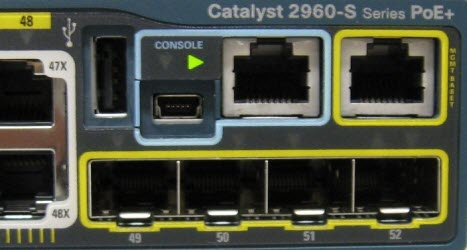

Normally router console port is an RJ45 port.

## Option 1 use the RJ45 in the device and use the serial port in your computer

Traditionally, you can use a rollover cable, this type of cable has a RJ45 in one end and a DB9 at the other:

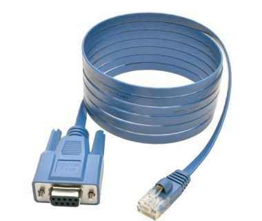

You then connect the RJ45 to the device and the DB9 to the serial port of your computer.

Legacy computers usually have this Serial/COM port:

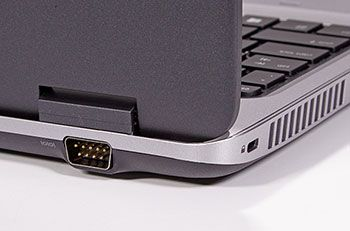

If you do not have the previous cable then you can also use a DB9 to RJ45 adapter and use a console cable:

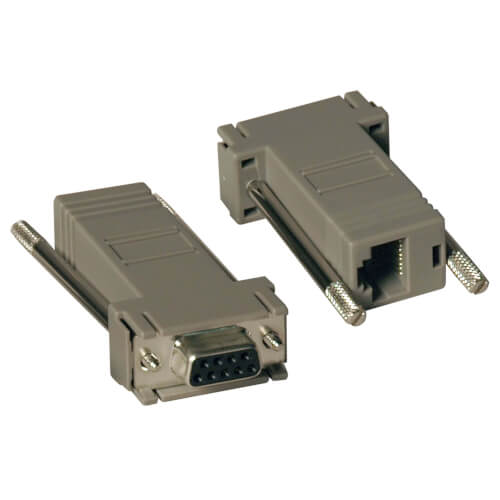

> DB9 to RJ45 adapter.

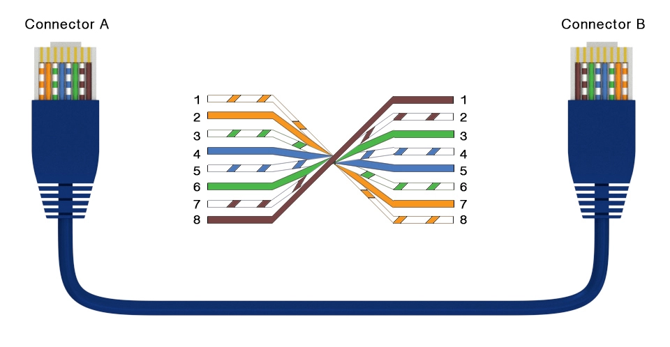

> Rollover wiring guide

You will connect one end to the cable to the device and the other to the DB9 adapter, finally connect the adapter to your PC:

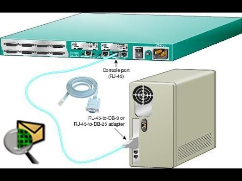

## Option 2 use the RJ45 in the device and a USB port in your PC

For this option you will need a rollover cable (either the one tha already has the DB9 and RJ45 ends or use a console cable and a DB9 to rj45 adapter) and a USB to serial adapter:

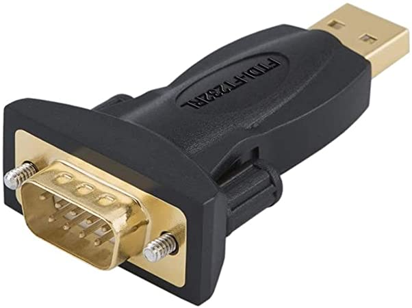

> This adapter may have a cable and be large.

You will end with the following configuration:

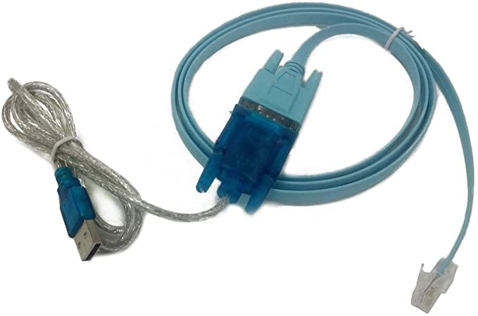

You can also use a console cable USB to RJ45:

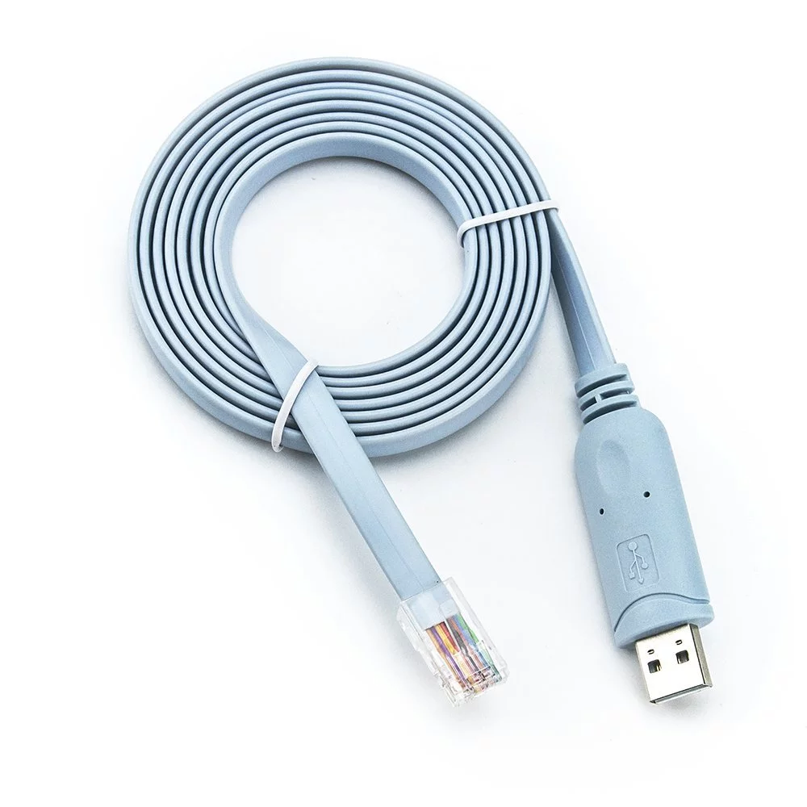

With this cable you just need to connect the RJ45 to the device and the USB to your PC:

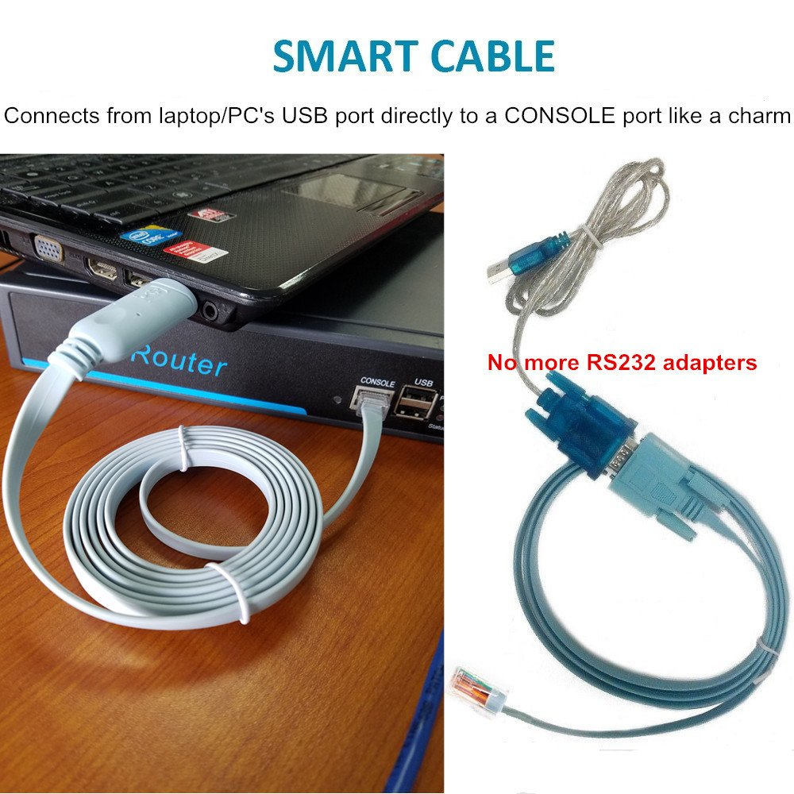

## Option 3 use the USB port in the device and a USB port in your PC

CISCO added a new USB console port to its products, that uses a cheap USB cable, that also widely used with other devices, for example external USB hard disk. Also the traditional RJ45 console port still available to provide compatibility with legacy PCs or to be used with the USB To Serial cable converters.

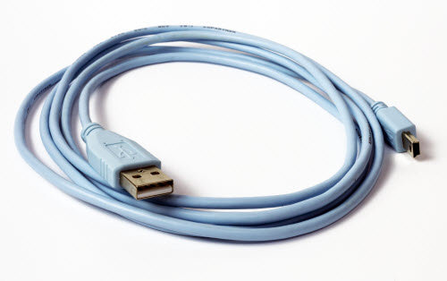

> The USB console port uses a USB Type A to 5-pin mini-Type B cable,

This USB console cable needs a driver to be installed to be usable with Cisco devices. You can download this driver for windows (32&64&2k), Linux, and Mac OS from the Cisco's Software page.

After you install the drive in your PC you can now connect the cable:

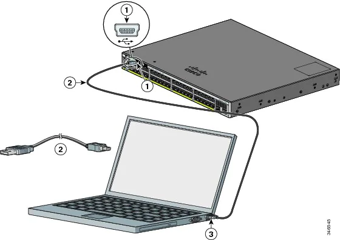

## Terminal software

The terminal software is also required for accessing the router and switches. The Tera Term, Putty, and Hyper Terminal are usually used to access the router and switches on a console port. Most People use Putty software for console access. The figure below shows the terminal window of putty.

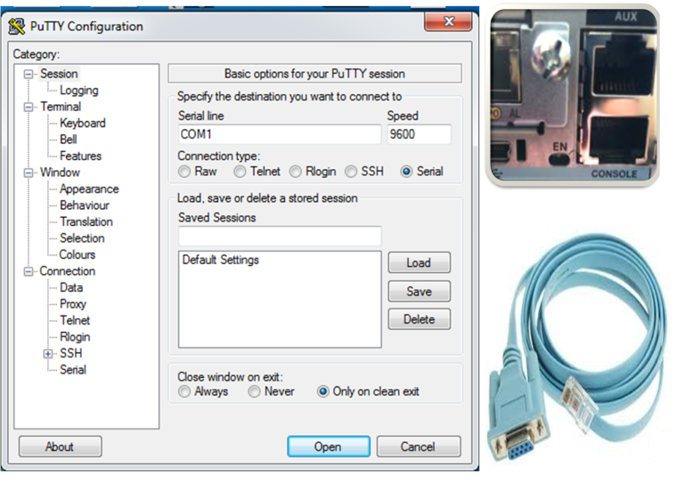

1. After downloading PuTTY, connect the console cable with Cisco Router or Swtich, double click putty.exe to execute it. Expand Connection > Serial. Enter the port number inside "Serial line to connect to" text box. The port number is COM4 in below example. The port number may be different in your computer. Enter the correct port number when you connect from your computer. Enter other values also as shown below:

    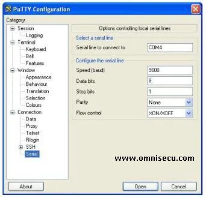

2. Click Session and click "Serial" radio button. Verify whether you can see the port number and the baud rate (9600) you had selected before. Click "Open" to connect to Cisco Router or Switch IOS:

    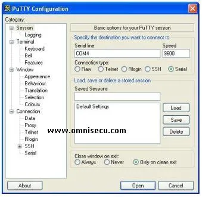

3. PuTTY is connected to Cisco IOS and now you can configure, monitor or manage a Cisco Router or Switch using putty:

    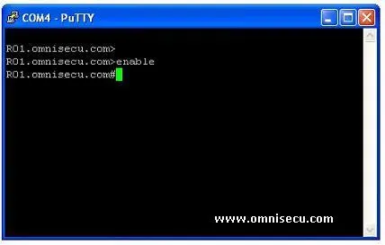

## Using console cable in Packet Tracer

Step 1

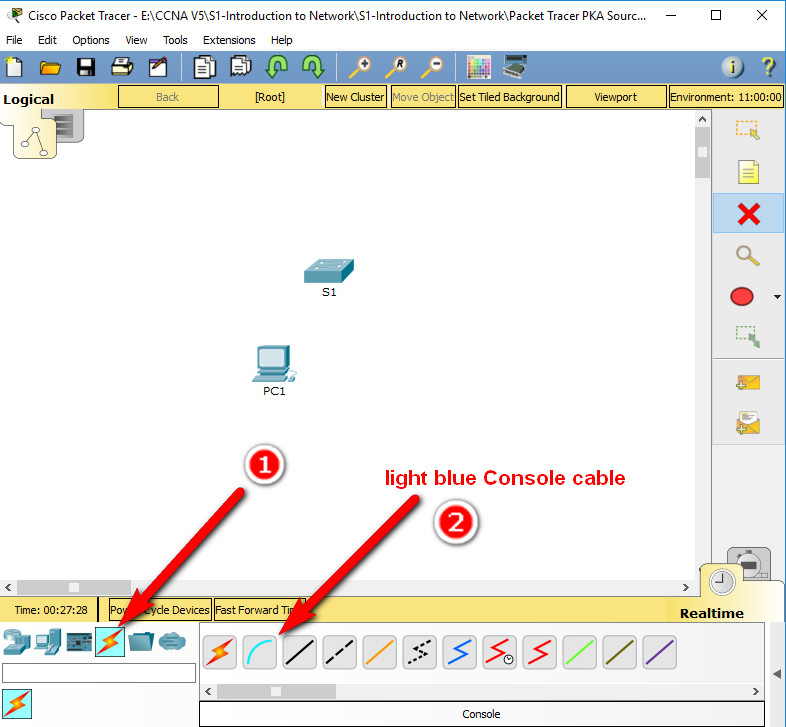

Step 2

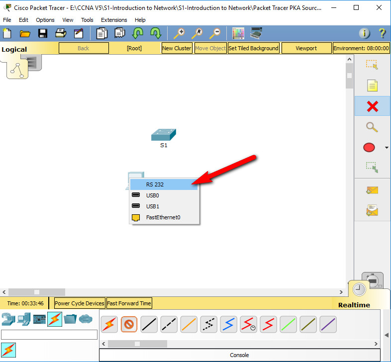

Step 3

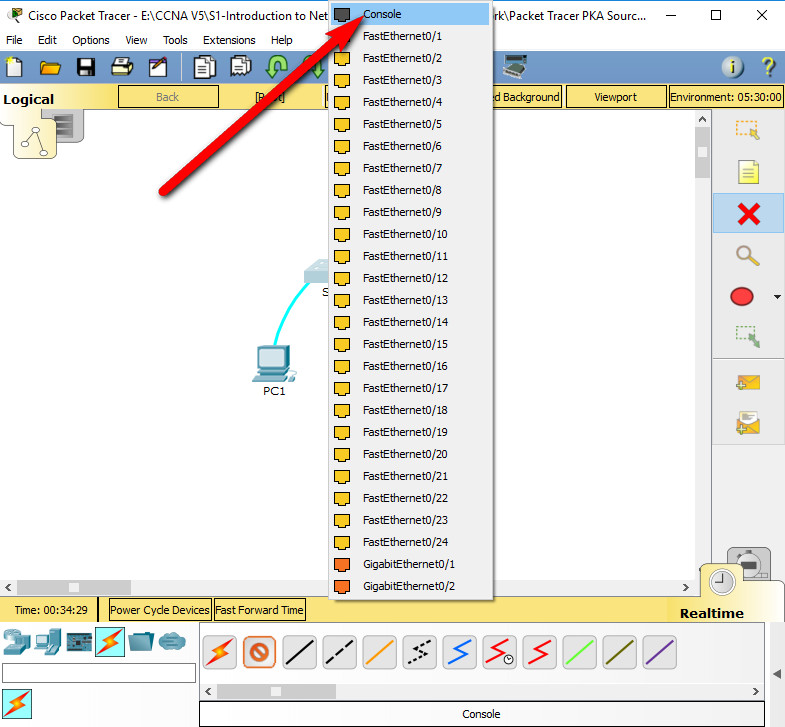

Step 4

Establish a terminal session with S1.

- Click PC1 and then select the Desktop tab.
- Click the Terminal application icon; verify that the Port Configuration default settings are correct.
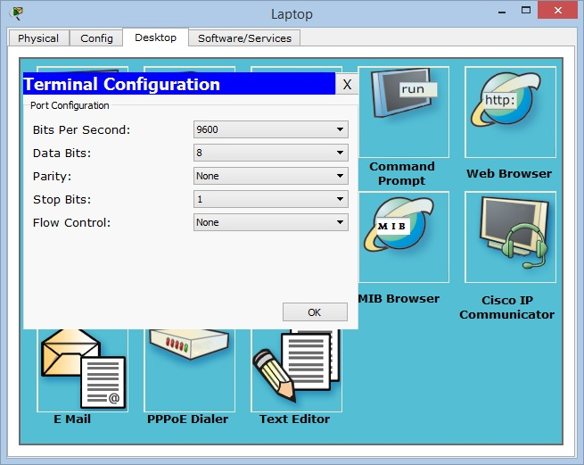
- Click OK.
- The screen that appears may have several messages displayed. Somewhere on the display there should be a Press RETURN to get started! message. Press ENTER.
- Now you are connected via Console.

## External resources

1. [https://www.omnisecu.com/cisco-certified-network-associate-ccna/how-to-use-putty-to-configure-or-monitor-a-cisco-router-or-switch.php](https://www.omnisecu.com/cisco-certified-network-associate-ccna/how-to-use-putty-to-configure-or-monitor-a-cisco-router-or-switch.php)
2. [https://www.eeweb.com/ethernet-cable-wiring/](https://www.eeweb.com/ethernet-cable-wiring/)