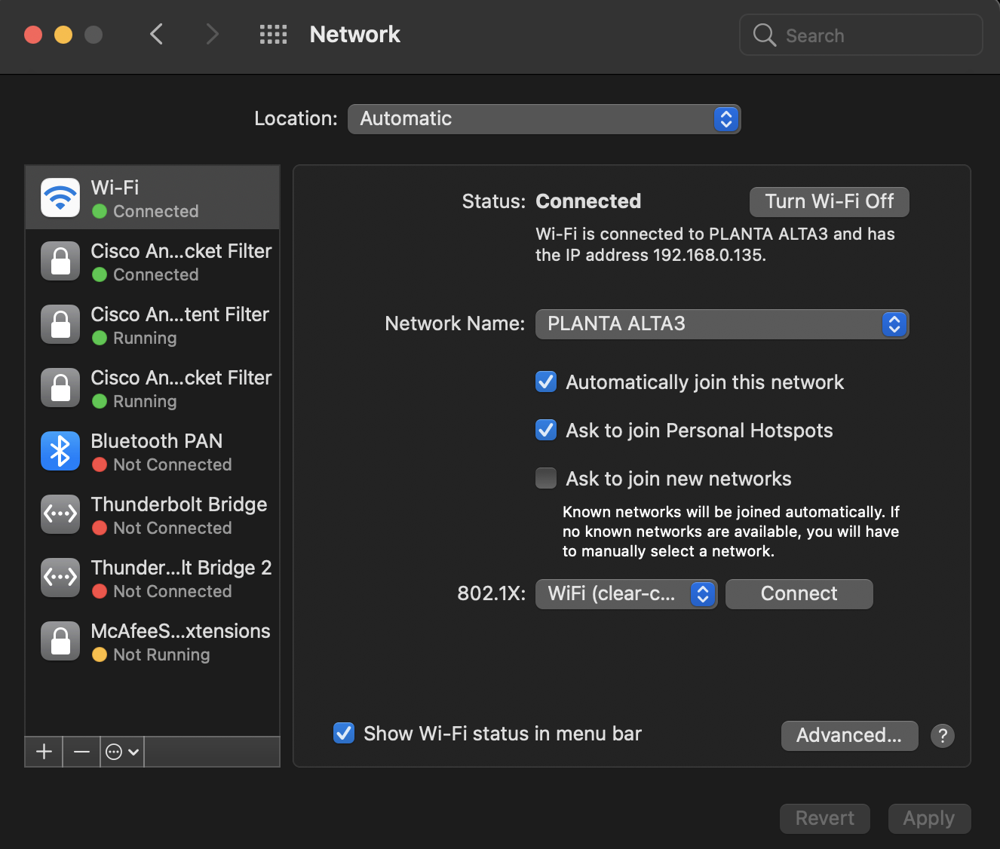

# Introduction to DHCP

The Dynamic Host Configuration Protocol (DHCP) it is used to provide IP addresses to devices that request it to DHCP servers.

## Display IP configuration settings

MAC OS:

Go to systems preferences:

Click on Network:

Select the network service (Wi-Fi in this case), and click on Advanced:

Finally click on TCP/IP:

Now you can see the IP configuration:

Note this PC is using DHCP. IPv4 address, Mask, and default router (router) were provided by the DHCP server.

DHCP servers can also provide DNS configuration. Domain Name System (DNS) is used to translate domain names to IP addresses, for example google.com to 172.217.0.174.

> You can use the `ifconfig` command in the terminal to display the IP configuration, unfortunately it does not say if it was provided by a DHCP server.

## Linux

## Windows

Check the following article: [https://winbuzzer.com/2021/07/28/how-change-ip-address-windows-10-xcxwbt/](https://winbuzzer.com/2021/07/28/how-change-ip-address-windows-10-xcxwbt/)