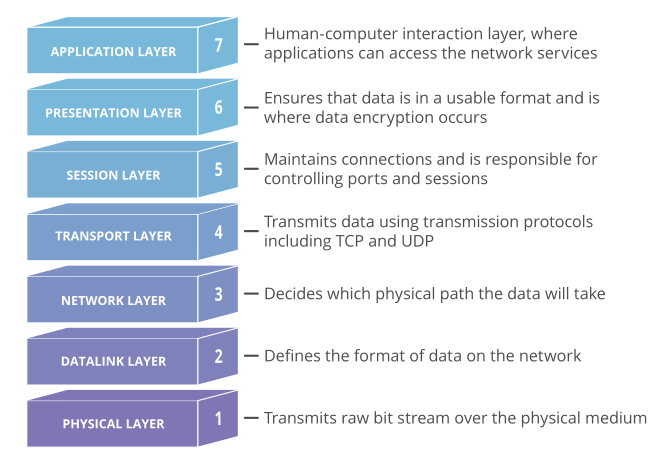
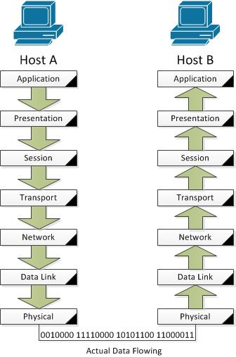
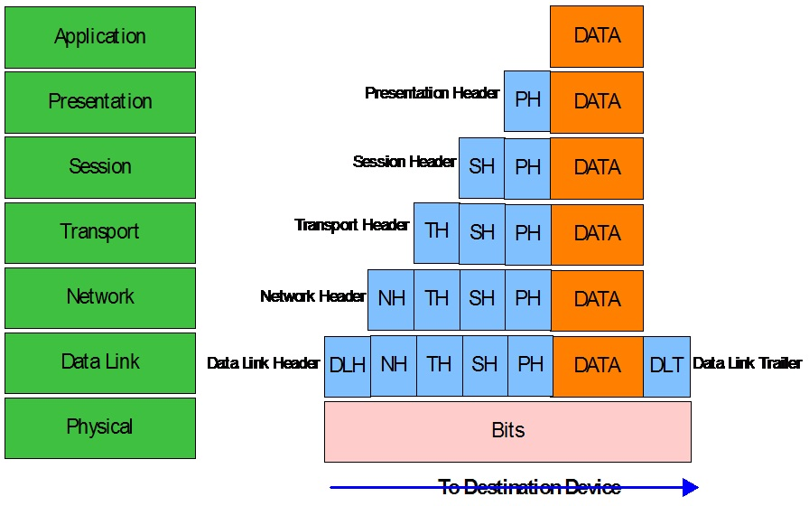
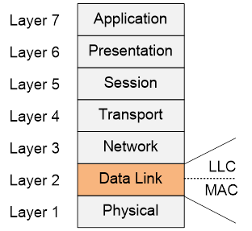
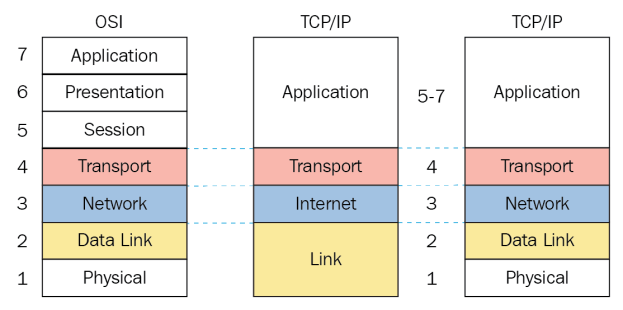

# Introduction to networks

## Index

- [What is a network](#what-is-a-network)
- [Protocols](#protocols)
- [Networking models](#networking-models)
    - [Benefits of a layered network model](#benefits-of-a-layered-network-model)
- [OSI model](#osi-model)
    - [Data flow through the OSI model](#data-flow-through-the-osi-model)
    - [Data encapsulation](#data-encapsulation)
    - [Layer 7 Application Layer](#layer-7-application-layer)
    - [Layer 6 Presentation Layer](#layer-6-presentation-layer)
    - [Layer 5 Session Layer](#layer-5-session-layer)
    - [Layer 4 Transport Layer](#layer-4-transport-layer)
    - [Layer 3 Network Layer](#layer-3-network)
    - [Layer 2 Data Link Layer](#layer-2-data-link-layer)
    - [Layer 1 Physical Layer](#layer-1-physical-layer)
- [TCP/IP model](#tcpip-model)
- [Protocol interaction](#protocol-interaction)

## What is a network?

A computer network is a data communications system which interconnects computer systems at various different sites.

Other definition:

    A network is a collection of computers, servers, mainframes, network devices, peripherals, or other devices connected to allow data sharing. 

## Protocols

Computer networks work because their elements follow **rules**, these rules comes in the form of standards or protocols which define this rules.

Protocols are agreements that devices must follow in order to have a communication (communication involves sharing data, resources, etc using the network).

> “A protocol defines the rules governing the syntax (what can be communicated), semantics (how it can be communicated), and synchronization (when and at what speed it can be communicated) of the communications procedure. Protocols can be implemented on hardware, software, or a combination of both. Protocols can be created by anyone, but the most widely adopted protocols are based on standards.” - From book The Illustrated Network. 

## Networking models

Networking models are used to organize the wide amount of networking protocols.

These models define a layered structure in which each level (or **layer**) describes the required functionality at an specific point of the communication.

Let's say you are sending an email, there are some technical steps that must follow an order, from writing the email, processing the data by your computer, encrypting the data, translating that data to bits, putting that data in a cable, etc. Each layer in a networking model will describe the process and expected results in a given step.

### Benefits of a layered network model

- Assists in protocol design, vendors can use the model to design/improve models considering the expected functionality.
- Fosters competition between vendors.
- Prevents a technology that functions at one layer from affecting any other layer.
- Provides a common language for describing network functionality.
- Helps in visualizing the interaction between each layer and protocols between each layer.

## OSI Model

The Open Systems Interconnection Model (OSI model), was developed by the International Organization for Standardization (ISO, yes, the name doesn't match).

The OSI model is a 7-layers networking model:

Yes, the structure start at 7 and ends at 1. In the OSI model the communication starts at layer 7, then the output of each layer is provided by the layer below, next layer adds information and passes it to the next layer again, finally layer 1 receives all the data and is responsible to put it on the cables (or radiofrequency signals if you are using wifi or bluetooth).

> Each protocol will reside in a specific layer according to the functions that performs.

**IMPORTANT**: The OSI model specifies **universal** set of rules in order to support interoperability between different products and software. Protocols then are responsible to define (and sometimes standardize) the technical implementations. **OSI defines the expected functionality and Protocols define how to do it**.

### Data flow through the OSI model

When a PC starts a communication to other PC the process starts at Layer 7, then the output of each layer is passed to the next layer, when the receiving PC has the data of Layer 1 it starts to reverse the process, data will be passed from layer 1 to layer 7 in the destination.

### Data encapsulation

As we already mentioned, each layer adds more data before passing the data to the next layer:

Layers add a header with its information add the beginning and sometimes a trailer at the end.

When the receiving device has the message it starts the **decapsulation** process (process and remove headers and trailers and then send the message to the layer above).

### Layer 7 Application Layer

This is the only layer that directly interacts with data from the user. 

Software applications like web browsers and email clients **rely** on the application layer to initiate communications.

**IMPORTANT**: client software applications are not part of the application layer; rather the application layer is responsible for the protocols and data manipulation that the software relies on to present meaningful data to the user.

Application layer protocols include HTTP as well as SMTP (Simple Mail Transfer Protocol is one of the protocols that enables email communications).

Common application protocols that work in this layer include: HTTP, FTP, SMTP, DNS, Telnet, SSH, IMAP, POP, SNMP, etc. These protocols will be studied in other sections.

> The data (or PDU: Protocol Data Unit) generated at layer 7 is know as "data"

### Layer 6 Presentation Layer

The presentation layer is responsible for:
- Translation: Translate incoming data (data from layer 5)
- Encryption and decryption: layer 6 encrypts data before sending it to layer 5 and decrypts data before sending it to layer 7, this adds security.
- Compression of data: This helps improve the speed and efficiency of communication by minimizing the amount of data that will be transferred.

Common examples for protocols and technology that operate in the Presentation layer include X.25, ZIP, XML, JSON, ASCII, EBCDIC, JPEG, MP3, etc.

> The data (or PDU: Protocol Data Unit) generated at this layer 6 is know as "data"

### Layer 5 Session Layer

The Session Layer provides **process to process** communications between two or more networked hosts

> A host is a device that has a complete network stack from physical to application layer, arbitrary applications run on a host.

This layer is responsible for maintaining proper communication by establishing, managing and terminating sessions (a property of TCP, a layer 4 protocol) between two nodes. It takes care of gracefully closing sessions and for session check pointing and recovery.

> The data (or PDU: Protocol Data Unit) generated at this layer 5 is know as "data"

### Layer 4 Transport Layer

**IMPORTANT**: Layers four through seven are known as the host layers. They define software that **implements network services**.

Protocols at layer 4 manage end-to-end message delivery.

*Ports* are a transport layer technology.

TCP and UDP are popular protocols at this layer.

> The data (or PDU: Protocol Data Unit) generated at this layer 4 is know as "segment"

### Layer 3 Network Layer

The network layer is responsible for facilitating data transfer between two **different** networks.

> If two devices communicating are on the same network, then the network layer is unnecessary.

The network layer breaks up data from Layer 4 (transport layer) into smaller units, called **packets**, on the sender’s device, and reassembling these packets on the receiving device.

The network layer also finds the best physical path for the data to reach its destination; this is known as **routing**.

**IMPORTANT**: Layers one through three are known as the **media layers**. They define hardware orientation such as routing (layer 3), switching (layer 2) and cable specifications. 

> The data (or PDU: Protocol Data Unit) generated at this layer 3 is know as "packet"

### Layer 2 Data Link Layer

Data link layer facilitates data transfer between two devices on the **SAME** network.

At this layer, **directly** connected nodes perform node-to-node data transfer, this transfer involves packaging the data from layer 3 into **frames**, which are packages that are suitable for the Layer 1.

A **node** is a physical electronic device hooked up to a network, for example a computer, printer, router, and so on. If set up properly, a node is capable of sending and/or receiving information over a network. "Links" connect nodes on a network. Links can be wired, like Ethernet, or cable-free, like WiFi (it is common to hear "the link between this PC and X device"). 

Besides converting data from Layer 3 to frames, Layer 2 is divided in two sub-layers:

- **Logical Link Control (LLC) layer**: controls frame synchronization, flow control and error checking.
- **Media Access Control (MAC) layer**: controls how a computer on the network gains access to the data and permission to transmit it (example: devices connected to your modem in your house need to decide who is going to transmit).

Data link layer is responsible for flow control and error control in intra-network communication (The transport layer only does flow control and error control for inter-network communications).

**Inter** means between two things.
- International: between two nation. Like international trade means trade between two nation.
- **Internet**: from one network to another or others.

**Intra** mean within something.

- **Intaurb**: within a city. Like intraurban bus service means bus service within a city.
- **Intranet**: within the same network

> The data (or PDU: Protocol Data Unit) generated at this layer 2 is know as "frame"

### Layer 1 Physical Layer

This layer is concerned with electrically or optically transmitting raw unstructured data bits across the network from the physical layer of the sending device to the physical layer of the receiving device.

> Physical layer cares about physical data transmission from source to destination.

It can include specifications such as voltages, pin layout, cabling, and radio frequencies. At the physical layer, one might find “physical” resources such as network hubs, cabling, repeaters, network adapters or modems.

> The data (or PDU: Protocol Data Unit) generated at this layer 1 is know as "bits"

## TCP/IP model

TCP/IP stands for Transmission Control Protocol/Internet Protocol and is a suite of communication protocols used to interconnect network devices on the internet. TCP and IP are the two main protocols, though others are included in the suit

Even though the TCP/IP model is what we use today, we still use the OSI model numbering.

TCP/IP functionality is divided into four layers, each of which includes specific protocols:

The TCP/IP model has suffered a few updates. In the middle of the image you can see the original version, and at the right the updated version.

> In the original version the Link layer was also known as "Network Access layer".

IMPORTANT: Learn the updated version of the TCP/IP model.

Note the current TCP/IP model matches the first 4 layers of the OSI model, layer 5, 6 and 7 are collapsed into Application layer in TCP/IP model.

## Protocol interaction

When a layer in a device communicates to the same layer in the destination device it is know as **same-layer interaction**. Example: HTTP used by your web browser communicates with the HTTP server of the page you are visiting.

When a layer communicates with the layer below of it or with the layer above it, it is know as **adjacent-layer interaction**. Example IP (layer 3) communicates to TCP (layer 4) asking for specific information.

# External resources

1. Definition of "network" [https://datatracker.ietf.org/doc/rfc1392/](https://datatracker.ietf.org/doc/rfc1392/)
2. [https://www.forcepoint.com/es/cyber-edu/osi-model](https://www.forcepoint.com/es/cyber-edu/osi-model)
3. [https://itexam24.com/what-are-two-benefits-of-using-a-layered-network-model-choose-two/](https://itexam24.com/what-are-two-benefits-of-using-a-layered-network-model-choose-two/)
4. [https://www.freecodecamp.org/news/osi-model-networking-layers-explained-in-plain-english/](https://www.freecodecamp.org/news/osi-model-networking-layers-explained-in-plain-english/)
5. [https://www.cloudflare.com/learning/ddos/glossary/open-systems-interconnection-model-osi/](https://www.cloudflare.com/learning/ddos/glossary/open-systems-interconnection-model-osi/)
6. [https://www.subnetting.net/school/docs/osi-model](https://www.subnetting.net/school/docs/osi-model)
7. [https://www.coengoedegebure.com/osi-model/](https://www.coengoedegebure.com/osi-model/)
8. [https://www.techtarget.com/searchnetworking/definition/TCP-IP](https://www.techtarget.com/searchnetworking/definition/TCP-IP)