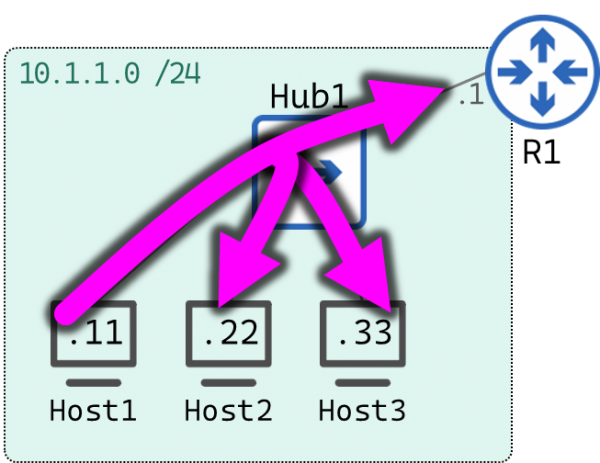

# IPv4 Special Addresses

There are a few special address in the IPV4 spectrum:

- Broadcast Addresses
- Loopback Addresses

## Broadcast addresses

A Broadcast is any frame or packet that is meant to be delivered to everyone on the local network. Broadcast address in the network can be of two types:

- **Limited (or local) broadcasts**: `255.255.255.255`
    - Hosts can use this IP address to send a packet to every node on the Local Network.

    

    In this example Host1 send a broadcast to the limited address.

    This also includes the router because it has an IP address in the same network of Host1:

```
Host1# ping 255.255.255.255
PING 255.255.255.255 (255.255.255.255): 56 data bytes
64 bytes from 10.1.1.11: seq=0 ttl=64 time=0.044 ms  <-- NOTE IT ALSO INCLUDES ITSELF!
64 bytes from 10.1.1.33: seq=0 ttl=64 time=0.944 ms (DUP!)
64 bytes from 10.1.1.22: seq=0 ttl=64 time=1.108 ms (DUP!)
64 bytes from 10.1.1.1: seq=0 ttl=255 time=1.324 ms (DUP!)
^C
--- 255.255.255.255 ping statistics ---
1 packets transmitted, 1 packets received, 3 duplicates, 0% packet loss
round-trip min/avg/max = 0.044/0.855/1.324 ms
Host1#
```

Limited broadcast address is used, for example, by host when requesting an IPv4 address to a DHCP server.

**IMPORTANT**: Limited broadcast address is always dropped by routers and layer 3 switches by default. If you want to have this functionality, for example if your DHCP server is in a different VLAN or in a remote network (basically if your DHCP server is not in the same broadcast domain), then you need to configure DHCP forwarding or DHCP relay. On Cisco switches you can use the `ip helper-address a.b.c.d` command in the interface configuration mode. With this command the switch still drops the broadcast, but send a unicast DHCP request on behalf of the host.

- **Directed (targeted) broadcasts**: `<network_portion>.<all_1s>`

With this address a host sends data to all devices pn a specific network.

In direct broadcast addresses the entire host portion is populated of 1s.

Routers can route direct broadcast, but in most routers this is disabled by default, this is recommended as malicious individuals can use hacking utilities to perform Denial Of Service attacks.

Example 1:

If a host has the IP address 192.168.0.34/24 then the directed broadcast address is 192.168.0.255.

Example 2:

If we have a remote network where we want to send a broadcast with the IPv4 address of 10.0.0.0/8. then the directed broadcast address is 10.255.255.255.


**IMPORTANT**: The Directed Broadcast can be used to speak to every node on a foreign network.

https://www.practicalnetworking.net/stand-alone/local-broadcast-vs-directed-broadcast/