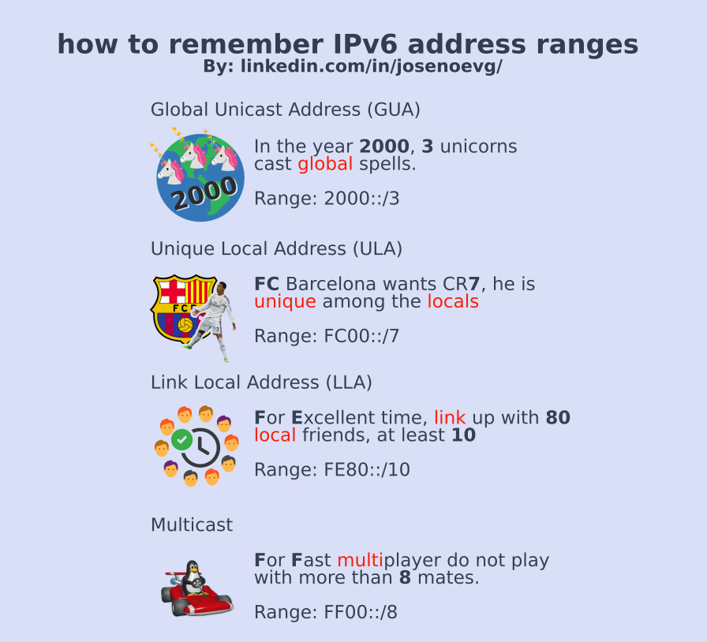

# IPv6 Address Types

Important notes:
- Broadcast addresses do not exist in IPv6 (there is an IPv6 all-nodes multicast address that essentially gives the same result).
- All-0s and all-1s host addresses can be assigned since broadcast addresses do not exist.
    - All-0s should be used only in routers as a subnet-router anycast address.

## Unicast
- **Global unicast address (GUA)**: These IPv6 addresses are similar to public IPv4 addresses in the sense that are routable in the Internet and are used to identify a specific host.
    - Range: `2000::/3`
    - Phrase to remember: In the year 2000, 3 unicorns cast global spells.
    - 2️⃣0️⃣0️⃣0️⃣ 🦄🦄🦄 🌎 ✨✨✨✨✨
    - When someone says Global think in the earth and that old tale of 3 unicorns that cast spells in the year 2000.

- **Link-Local address**: Used for communication on the same link (subnet) and ONLY in that link. These addresses are not routable beyond the link.
    - Example: Use link-local address to communicate two routers.
    - Range: `FE80::/10`
    - Phrase to remember: For Excellent time link up with 80 local friends, at least 10.
    - 👌 ⏱️ 🔗  8️⃣0️⃣👤 | 1️⃣0️⃣👤
    - When someone says Link-local think in linking up For Excellent time with 80 friends or at least 10.

- **Unique Local addresses (ULA)**: These addresses are similar to the IPv4 private addresses (RFC 1918).
    - Range: `FC00::/7 to FDFF::/7`
    - Phrase to remember: At FC Barcelona, CR7 used to play, he was unique among the locals
    - 🇪🇸⚽ CR7
    - When someone says Unique think in the FC Barcelona, they had CR7 and he was unique among the locals.

- **Loopback**: `::1/128`

- **Unspecified address**: correspond to 0.0.0.0 in IPv4.
    - Range: `::/128`
    - Read more [here](http://www.ipuptime.net/Unspecified.aspx)

## Multicast
- Range: `FF00::/8`
- There are 2 types of IPv6 multicast addresses:
    - **Assigned multicast**: Addresses that are reserved for predefined groups of devices, for example:
        - FF02::1 All-nodes multicast group: this send packets to all IPv6-enabled devices (this has the same effect as a broadcast).
        - FF02::2 All-routers multicast group: This is for all IPv6 routers on the link or network. Routers need to be configured with the `ipv6 unicast-routing` global configuration command to join this group.
    - **Solicited node multicast**: Similar to the all-nodes multicast address, but this address is mapped to a special Ethernet multicast address. This allows the Ethernet NIC to filter the frame based in the MAC address, if the MAC address is not the expected then the frame is dropped (this saves the processing at layer 3)
- Phrase to remember: For fast multiplayer do not play with more than 8 mates
- 🏎️ 🕹️ 8️⃣👤
- When someone says Multicast think we need it for fast multiplayer with no more than 8 mates.

## Anycast
 An IPv6 anycast address **is any IPv6 unicast address** that can be assigned to multiple devices. A packet sent to an anycast address is routed to the nearest device having that address. Anycast addresses are beyond the scope of this course.

## External resources
 - https://www.ripe.net/manage-ips-and-asns/ipv6/ipv6-address-types/ipv6-address-types