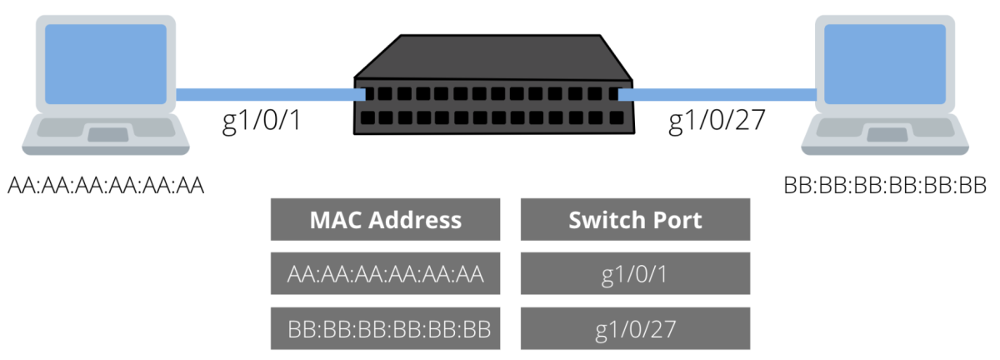
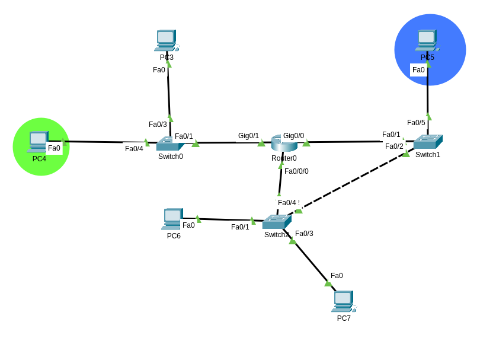

# Layer 2 and layer 3 Addressing

Network devices use addresses to identify themselves, identify the network they belong to, and other networks.

- At layer 2 we use Media Access Control addresses, **MAC** addresses for short. **Switches** are Layer 2 devices that take decisions based in MAC addresses
- At layer 3 we use **IP** addresses. **Routers** are Layer 3 devices that use IP addresses to take decisions based in IP addresses. **IP addresses contain the information of the network and the unique identifier for each computer**, we will explore the format later.

Home routers, or modems are a combination of three devices (switch, router, firewall, the later will be discussed in other sections).

Home routers, as any other device in the network, also has one MAC address and one IP addresses assigned. The IP address of the home router is known as **default gateway** for devices connected to the router. This mean that your PC, phone, voice assistant, etc have configured the default gateway along with their own IP address and MAC address.


## Why do computers need both MAC Addresses and IP Addresses?

In the real world **both** MAC addresses and IP addresses are used in conjunction.

- MAC addresses are used to decided where messages are physically forwarded.
- IP addresses are used to decided the logic to route the messages thought the network.


When you send a message to other device the message contains not only tswihe data you want to send but also the MAC address and IP address of your computer (source) AND the MAC address and IP address of the other computer (or destination).



> Image above shows a switch in the middle, and 2 PCs connected to the ports in the switch. below you can see the MAC address table of the switch, this table maps the MAC address of each PC to a port in the switch, this is used to identify the PCs physically.

> NOTE: although both terms have a different meaning, port and interface are commonly used interchangeable.

Switches use MAC addresses to know which interface will be used to forward messages.

In the other hand, IP addresses are needed to **logically** identify a computer, maybe two computers are connected to the same modem (remember that modems also have a basic switch), but each computer are logically in different networks, or maybe you want to access google.com and the google servers are in another country. If this is the case then devices need to have intelligence to make further decisions, they need to know where to forward messages physically, that's fine we can use MAC addresses, but we cannot learn all MAC addresses in the world, IP addresses are used to logically locate/identify a PC. When a router receives a message it make logical decisions based in the IP address to forward the message to another network device, the next network device will again evaluate the best route to forward the message, the process continues until the message reaches its destination, this is a logical process, IP addresses contain information to choose the best path to forward the messages.

IP addresses are used to say: This PC is in X network, I do not know where is that network physically but I can make a decision to choose the best path or direction to forward the messages, the device that receives the message will choose the best path again until the message reach its destination. During this process MAC addresses to physically find the next device to forward the message.



> This diagram shows a switch an a router as separate devices, this is common in the network infrastructure, non-experienced users or non-IT people maybe do not known this devices at all and they will never see them as this is what is running behind  scenes.

If you are PC4 (green circle) and want to communicate with PC5 (blue color) you know you can use the MAC address to reach Router0, but since PC5 is in a different network, Router0 needs to think more and decide whether use Switch2 to forward your message or send it directly to Switch1. Of course Router0 knows the MAC address of the interfaces in Switch0, Switch1 and Switch2, but maybe the link between Router0 and Switch1 is pretty slow. Besides this, the router uses the IP address of PC5 to logically decide and forward your message.

What if you (PC4) want to communicate to PC3 and both computers are logically in the same network, in that case Switch0 can forward the message, it doesn't even need to check with Router0. Remember that Switches are layer 2 devices that work pretty well with MAC addresses.

What if you (PC4) want to communicate to PC3 and both computers are **NOT** in the same network logically, in that case Switch0 needs to send the message to the router, because Layer 3 devices take decisions to connect different networks (of course the router will send back the message to the switch in this case, that's expected since both PCs are in different networks logically).

Now let's see how MAC and IP addresses look like.

## Layer 2 addresses

MAC (Media Access Control) addresses are primarily assigned by device manufacturers, and are therefore referred to as the `burned-in address`, or as an Ethernet hardware address, hardware address and physical address.

Each MAC address can be stored in hardware, such as the card's read-only memory, or by a firmware mechanism.

> You can change MAC addresses, but generally you don't have to.

### Representation

MAC addresses are `48 bits` long and is represented as a string of `12 hexadecimal digits`.

These are example of common representations across multiple systems/vendors:

```
00-0a-83-b1-c0-83
00:0a:83:b1:c0:83
000.a83.b1.c083
```

### How to find MAC addresses

- Command for UNIX/Linux

        ifconfig -a
        ip link list 
        ip address show

- Command for Windows OS

        ipconfig /all 

- MacOS

        Check the TCP/IP Control Panel

### OUI

The first 24 bits (3 octets) are called `Organizationally Unique Identifier (OUI)`.

The IEEE assigns these first 24 bits to its registered vendors.
You can see a list of OUIs and the organization that use it here: https://standards-oui.ieee.org/oui/oui.txt

### Network Interface Controller (NIC) Specific

The last 24 bits is used by vendors to uniquely identify each device.

## IP addresses

Currently there are two versions of IP running in the world:

- IP version 4 (IPv4): The old version, it is expected to transition to the new version
- IP version 6 (IPv6): The newest version.

### IPv4

IPv4 addresses are 32 bits long and are represented by 4 numbers separated by dots:

    192.168.0.1

Each number can go from 0 to 255. In binary we need 8 bits for the number 255, that's why there are 4 numbers (4x8=32bits).

IPv4 address are combined with a network **mask**, for example:

    192.168.0.0/24

This means that the first 24 bits (192.168.0) represent a network. All the computers in this network will share the first 24 bits.

The other 8 bits are use to uniquely identify each computer:

    192.168.0.1/24  <-- Computer 1
    192.168.0.2/24  <-- Computer 2
    192.168.0.3/24  <-- Computer 3
    192.168.0.4/24  <-- Computer 4
    etc etc, until we use the other 8 bits

### IPv6

IPv6 addresses are 128 bits long, and are represented by 32 hexadecimal digits, grouped by 4 bits and separated by a colon:

    AAAA:BBBB:CCCC:DDDD:EEEE:FFFF:1111:2222

Each digit represent 4 bits (4x32=128bits).

In IPv6 addresses have different parts that used to identify the subnet, computer, etc. This will be discussed in other sections.