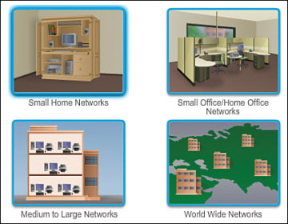
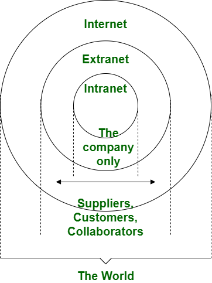
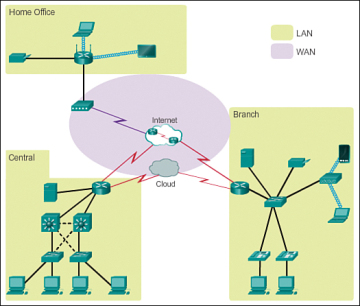
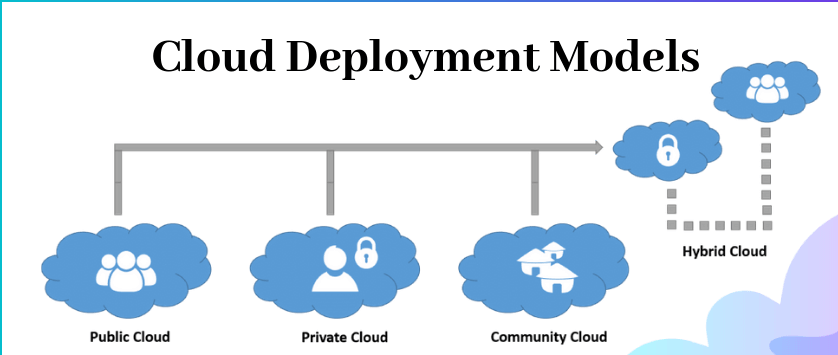

# Network types

Computer networks can be classified based on their size, for example:

- **Small Home Networks**: these networks connect a few devices to each other and the Internet
- **SOHO**: Small Office Home Office, these are Small Home Networks that also provide connection to a corporate network or access to centralized shared resources.
- **Medium to large networks**: Corporations or schools with hundreds oh interconnected computers.
- **World Wide Networks**: Internet is the biggest network in the world, it connects computer world-wide.

## What is the Internet

It is a worldwide collection of interconnected networks. Google, Facebook, Youtube, Netflix etc. have their servers connected to the Internet, that is why you can access their services.

> There are organizations that have been developed for the purpose of helping to maintain structure and standardization of Internet protocols and processes (for example: IETF, ICANN, IAB, etc.)

The Internet is not owned by any individual or group.

**Curious fact**:
    
    The term internet (with a lower case “i") is used to describe multiple networks interconnected.
    
    The term Internet (with a capital “I”) is used referring to the global system of interconnected computer networks or the World Wide Web

## Intranet vs Extranet

The **Internet** is a global collection of computer networks known as the world wide web.

On the other hand, an **intranet** is an online network only company employees can access.

An **extranet** is an extension of an intranet. It lets approved third parties (such as vendors or customers) access restricted information.

Not all company information should live on the internet. So, businesses can use an intranet as a digital workspace where employees can access resources, follow company updates, and connect. When you create a network that third parties can access, that’s called an extranet.

## Types of network infrastructure

There are 2 common types f network infrastructures:

- **Local-area network (LAN)**: A network infrastructure that provides access to users and end devices in a small geographical area.
- **Wide-area network (WAN)**: A network infrastructure that provides access to other networks over a wide geographical area. WANs are typically managed by service providers (SP) or **Internet service providers (ISP)**.

Other types of networks include:

- **Metropolitan-area network (MAN)**: A network infrastructure that spans a physical area larger than a LAN but smaller than a WAN (for example, a city). MANs are typically operated by a single entity such as a large organization.
- **Wireless LAN (WLAN)**: Similar to a LAN but wirelessly interconnects users and endpoints in a small geographical area.
- **Storage-area network (SAN)**: A network infrastructure designed to support file servers and provide data storage, retrieval, and replication. It involves high-end servers, multiple disk arrays, and Fibre Channel interconnection technology.

## Topology diagrams

It is a "picture" that represents the devices and connections that make up a network

**Types**:

- **Physical topology**: Identify the physical location of intermediary devices and cable installation.
- **Logical Topology**: Identify devices, ports, and addressing scheme.

Terminology to remember:

- **NIC** (Network Interface Card) or LAN adapter: provides the physical connection to the network.
- **Physical Port**: A connector or outlet on a network device* where the media is connected to an end device or another networking device.
- **Interface**: Specialized port, *that connect to individual networks*

### Physical topologies

WIP: recreate this image in inkscape: https://ipcisco.com/wp-content/uploads/Network-Topologies.jpg

- **Bus**: all the network nodes are connected to a common network media and only one node can receive and transmit data at a time.
- **Ring**: All the nodes are connected on a medium and messages are travels through one direction.
- **Star**: all the devices are connected to a central device.
- **Extended Star**: In this topology, there are end device and sub end devices. All the sub end devices are connected to end devices. And they are connected to the central device.
- **Line**: Also know as daisy chain, It is created by connecting each node end to end in series.
- **Point-to-Point**: is a permanent link (connection) between two endpoints (do not confuse a point-to-point physical connection with a point-to-point service/communication model).
- Partial Mesh: some of the devices of the network are connected to more than one other device in the network with a point-to-point link.
- Full Mesh: everyone is connected to each other. The number of connections in a full mesh network of n nodes is = n(n - 1) / 2
- Tree: t is also known as a hierarchical topology and has a central root node that is connected to one or more nodes of a lower hierarchy.
- Hybrid topology: they have a combination of two or more basic network structures.

## Home and Small Office Internet Connections

**Cable**
- Typically offered by cable television service providers.
- The Internet data signal is carried on the same cable that delivers cable television.
- It provides a high bandwidth, always on, connection to the Internet. 

**DSL**, Digital Subscriber Line
- Provide a high bandwidth, always on, connection to the Internet
- Runs over a telephone line.
- Small office and home office users connect using Asymmetrical DSL (ADSL), which means that the download speed is faster than the upload speed.

**Cellular**
- Uses a cell phone network to connect.
- Performance will be limited by the capabilities of the phone and the cell tower to which it is connected

**Satellite**
- Is a real benefit in those areas that would otherwise have no Internet connectivity at all.
- Satellite dishes require a clear line of sight to the satellite. 

**Dial-up Telephone**
- An inexpensive option that uses any phone line and a modem.
- low bandwidth, but useful for mobile access while traveling. 

> Many homes and small offices are now being connected directly with fiber-optic cables. This enables an Internet service provider to provide higher bandwidth speeds and support more services such as Internet, phone, and TV.

## Business Internet Connections

**Dedicated leased line**:
- They are reserved circuits within the service provider’s network that connect geographically separated offices for private voice and/or data networking.
- They can be expensive
- SLA (service level agreement)

**Metro Ethernet**:
- Ethernet is a LAN access technology.
- With Metro Ethernet the benefits of Ethernet are now being extended into the WAN. 

**DSL**:
- Symmetric Digital Subscriber Lines (SDSL) provides uploads and downloads at the same speeds.

**Satellite**:
- Provide a connection when a wired solution is not available. 

## Converged networks

Converged networks are those who are capable of delivering data, voice, and video between many different types of devices **over the same network infrastructure**.

## Trends at home

- **Smart home** technology is technology that is integrated into every-day appliances allowing them to interconnect with other devices, making them more ‘smart’ or automated.

- **Powerline Networking** uses existing electrical wiring to connect devices
“**no new wire**s” means the ability to connect a device to the network wherever there is an electrical outlet.

- **Wireless Broadband**: Wireless Internet Service Provider (WISP) is an ISP that connects subscribers to a designated access point or hot spot using similar wireless technologies found in home wireless local area networks (WLANs)

    This service uses the same cellular technology used to access the Internet with a smart phone or tablet.

    An antenna is installed outside the house providing either wireless or wired connectivity for devices in the home

## Network trends

**Online Collaboration**: Cisco WebEx, Zoom, etc.

**Video communication**: Video conferencing is a powerful tool for communicating with others at a distance

**BYOD**: Bring Your Own Device means any device, with any ownership, used anywhere  to access information and communicate across a business or campus network

**Cloud Computing**
Allows the access to remote resources ready to use. Amazon Web Services, Google Cloud Platform, Oracle Cloud Infrastructure, Microsoft Azure are example of cloud providers. These providers gives you remote access to computing services and resources, for example: databases, virtual machines, storage, etc. There are a few deployment models in the cloud:

- **Private cloud**:The cloud infrastructure is **provisioned for exclusive use** by a single organization comprising multiple consumers (e.g., business units).  It may be owned, managed, and operated by the organization, a third party, or some combination of them, and it may exist on or off premises.
- **Community cloud**:  The cloud infrastructure is **provisioned for exclusive use by a specific community of consumers** from organizations that have shared concerns (e.g., mission, security requirements, policy, and compliance considerations). It may be owned, managed, and operated by one or more of the organizations in the community, a third party, or some combination of them, and it may exist on or off premises.
- **Public cloud**: The cloud infrastructure is **provisioned for open use** by the general public. It may be owned, managed, and operated by a business, academic, or government organization, or some combination of them.  It exists on the premises of the cloud provider.
- **Hybrid cloud**: The cloud infrastructure is a composition of two or more distinct cloud infrastructures (private, community, or public) that remain unique entities, but are bound together by standardized or proprietary technology that enables data and application portability (e.g., cloud bursting for load balancing between clouds).  
- **Multi-cloud**: blends different clouds (Oracle, Azure, etc.) of the same type (private, community, or public).

## External resources

1. [https://www.ciscopress.com/articles/article.asp?p=2164577&seqNum=4](https://www.ciscopress.com/articles/article.asp?p=2164577&seqNum=4)
