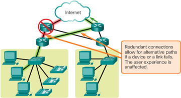
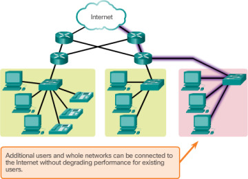
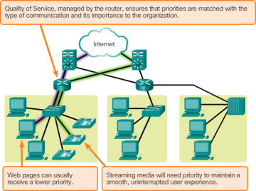
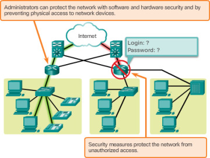

# Reliable networks

## Fault Tolerance

"always available": 
- Limits the impact of a failure.
- Quick recovery when a failure occurs.
- Redundancy: Having multiple paths to a destination.

This is not the case in **circuit-switched** networks traditionally used for voice communications, it establishes a dedicated circuit between the source and destination before the users may communicate. If the call is unexpectedly terminated, the users must initiate a new connection.

### BONUS TOPIC: Circuit Switching vs Packet Switching

Circuit Switching and Packet Switching are two of the main models used to facilitate connections within enterprise networks

- **Circuit switching**: Circuit switching is when a dedicated channel or circuit needs to be established before users can speak to each other on a call. A channel used in circuit switching is kept reserved at all times and is used once the two users communicate.
    - Circuit switching connections are classified as half-duplex or full-duplex. Half-duplex communications allocate one channel and full-duplex communications allocate two channels.
- **Packet switching**: Packet switching is different from circuit switching because there is no requirement to establish a channel. The channel is available to users throughout the data network. Long messages are broken down into packets and sent individually to the network.
    - The problem with this method is that packets can arrive out of sequence or even be lost in transit altogether.

## Scalability

A scalable network can **expand quickly** to support new users and applications without impacting the performance of the service being delivered to existing users.

## Quality of service (QoS)

QoS becomes a primary mechanism for managing congestion and ensuring reliable delivery of content to all users.

**Congestion** occurs when the demand for bandwidth exceeds the amount available.

## Security

### Network infrastructure security

It includes the **physical** securing of devices that provide network connectivity, and **preventing unauthorized access** to the management software that resides on them

### Information security

It refers to protecting the information within the packets being transmitted, and the information stored.

CIA triad:

- **Confidentiality**: only the intended and authorized recipients can access and read data
- **Integrity**: having the assurance that the information has not been altered in transmission
- **Availability**: timely and reliable access to data services for authorized users

## External resources

1. [https://www.comparitech.com/net-admin/circuit-switching-vs-packet-switching/](https://www.comparitech.com/net-admin/circuit-switching-vs-packet-switching/)
2. [https://www.ciscopress.com/articles/article.asp?p=2755711&seqNum=6](https://www.ciscopress.com/articles/article.asp?p=2755711&seqNum=6)