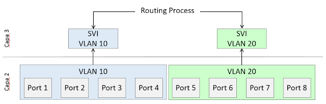

# Switch Virtual Interfaces

A virtual LAN or VLAN is any broadcast domain that is segregated and isolated at the data link layer  OSI layer 2.

VLANs reduce the load on a network by keeping local traffic within a VLAN. However, because each type VLAN its own domain, a mechanism is needed for VLANS to pass data to other VLANS without passing the data through a router.

The solution is switched virtual interface. An SVI interface is usually found on Layer 3 switches. With SVIs the switch recognizes the packet destinations that are local to the sending VLAN and then routes packets destined for different VLANs.

An SVI interface can be created for each VLAN that exists but only one SVI can be mapped to each VLAN. **An SVI  is virtual and has no physical port defined and performs the same functions for the VLAN as a router interface**. SVI is also called Interface VLAN.



> Typically an SVI is the default gateway of the terminals that are part of the broadcast domain defined by a VLAN.

Catalyst switches (both Layer 2 and Layer 3) have an SVI interface created by **default which is the VLAN1 interface**. Since VLAN 1 is the default management VLAN on Catalyst switches, this is the interface on which the necessary IP configuration for Telnet, SSH, HTTP, and HTTPS access is entered.

## Remote management

SVIs also provides a means to remotely manage a switch over the network using IPv4.

Configuration:

```
• Switch(config)#interface vlan 1
• Switch(config-if)# ip address {ip-add} {mask}
• Switch(config-if)# no shutdow   <-- this's because the vlan1 is not activated by default
```

> **WARNING**. With this configuration, any device **CONNECTED** to a port on the switch will have **connection** (ping) with this Switch.

To have **access** to the switch CLI, we need to:

- Configure a line VTY to allow Telnet access
- And set the privileged exec password

After doing this we can use the following command on the CMD of a windows PC (or terminal in unix like OSs):

```
C:\telnet ip_address_of_the_SVI
```

If we want to access to the switch from another network we need to add a default gateway:

```
Switch(config)#ip default-gateway x.x.x.x
```

## Configure VTY lines


## External resources

1. En [https://ipwithease.com/vlan-vs-svi/](https://ipwithease.com/vlan-vs-svi/)
2. Es [http://librosnetworking.blogspot.com/2015/06/que-es-una-svi.html](http://librosnetworking.blogspot.com/2015/06/que-es-una-svi.html)