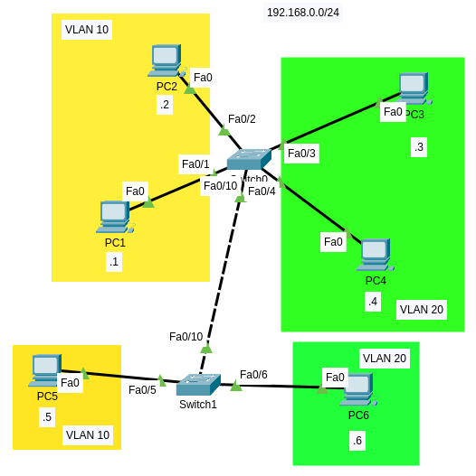
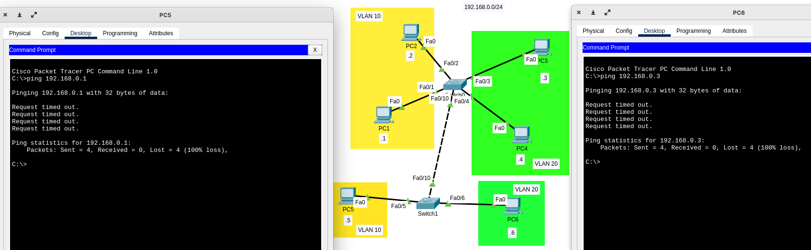
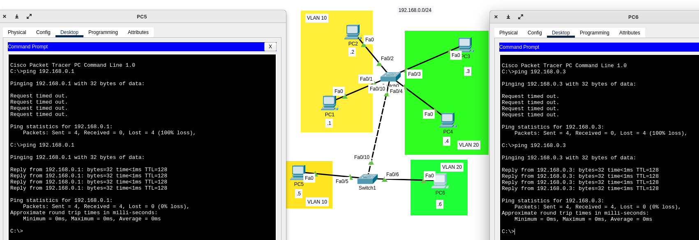

# Trunk links and DTP

## What is a trunk

A trunk is a point-to-point link between two switches. This link allows traffic from many VLANs to move between the switches.

When configuring trunk ports it is important to know these other concepts:

- **Native VLAN**: This is the port that the switch uses to send untagged traffic. Tagged traffic is all traffic destined to a particular VLAN. Untagged traffic may be any traffic which is not destined to any particular VLAN such as control information.
- **Dynamic trunk protocol**: DTP is a CISCO proprietary protocol that negotiates the trunking modes between switches.

## Switchport modes

A switch port can be in one of two modes: access and trunk.

There are two ways a switch port can settle down into one of these two modes:

- **Static**: You manually configure a switch port to be in the access or trunk mode in the static method.
- **Dynamic**: You can let Dynamic Trunking Protocol (DTP) run on an interface to negotiate trunking in the dynamic method.

## Static configuration

You can configure trunk links in two switches by setting the access mode as `trunk`.



In this lab Switch0 is connected to Switch1 using the interface FastEthernet0/10 in both switches.

### Configure VLAN 10 and VLAN 20 in Switch1:

```Switch>en
Switch#conf t
Enter configuration commands, one per line.  End with CNTL/Z.
Switch(config)#hostname Switch1
Switch1(config)#

Switch1(config)#int f0/5
Switch1(config-if)#switchport mode access 
Switch1(config-if)#switchport access vlan 10
% Access VLAN does not exist. Creating vlan 10

Switch1(config-if)#int f0/6
Switch1(config-if)#switchport mode access 
Switch1(config-if)#switchport access vlan 20
% Access VLAN does not exist. Creating vlan 20
Switch1(config-if)#
```

Switch0 was already configured.

If You want to ping a PC from a PC in Switch1 to a PC in Switch0 it is not possible, even when both PCs are in the same VLAN:



In the image above PC5 ping PC1 and PC6 ping PC3. Both failed.

### We are going to configure a trunk link:

Switch 0:

```
Switch>en
Switch#conf t
Enter configuration commands, one per line.  End with CNTL/Z.
Switch(config)#hostname Switch0
Switch0(config)#int f0/10
Switch0(config-if)#switchport mode trunk 
Switch0(config-if)#
%LINEPROTO-5-UPDOWN: Line protocol on Interface FastEthernet0/10, changed state to down

%LINEPROTO-5-UPDOWN: Line protocol on Interface FastEthernet0/10, changed state to up

Switch0(config-if)#switchport trunk native vlan 99
Switch0(config-if)#
%CDP-4-NATIVE_VLAN_MISMATCH: Native VLAN mismatch discovered on FastEthernet0/10 (99), with Switch1 FastEthernet0/10 (1).

Switch0(config-if)#switchport trunk allowed vlan 10, 20, 99
                                                     ^
% Invalid input detected at '^' marker.

Switch0(config-if)#switchport trunk allowed vlan 10,20,99
Switch0(config-if)#
```

Note you need to provide the list of VLANS using a comma separated format, but you do NOT need to add a space between each VLAN.

Also note the message `%CDP-4-NATIVE_VLAN_MISMATCH: Native VLAN mismatch discovered on FastEthernet0/10 (99), with Switch1 FastEthernet0/10 (1).` Remember that native VLAN on trunk ports is 1 by default, since we configured VLAN 99 as the default VLAN in Switch0 the devices discovered this using a protocol called CDP (Cisco Discovery Protocol, more about this later).

You will see the same mismatch message in Switch1.

Switch ports in switches Cisco 2960 are in dynamic auto by default, this mode creates a trunk link if the neighbor port (the port in other switch) is configured as trunk. This is caused by a feature called DTP, since this part is showing how to configure a trunk link statically we are going to configure the switchport mode in Switch1 to Trunk:

```
Switch1>en
Switch1#conf t
Enter configuration commands, one per line.  End with CNTL/Z.

Switch1(config)#int f0/10
%CDP-4-NATIVE_VLAN_MISMATCH: Native VLAN mismatch discovered on FastEthernet0/10 (1), with Switch0 FastEthernet0/10 (99).

Switch1(config-if)#switchport mode trunk 
Switch1(config-if)#switchport trunk native vlan 99
Switch1(config-if)#switchport trunk allowed vlan 10,20,99
Switch1(config-if)#
```

Now both switches have configured a trunk link statically, PCs in Switch1 can now ping PCs in Switch0 and vice versa:



### Benefits of configuring a static trunk link

- Prevent negotiation.

### Explore VLANs

```Switch0#show vlan brief 

VLAN Name                             Status    Ports
---- -------------------------------- --------- -------------------------------
1    default                          active    Fa0/5, Fa0/6, Fa0/7, Fa0/8
                                                Fa0/9, Fa0/11, Fa0/12, Fa0/13
                                                Fa0/14, Fa0/15, Fa0/16, Fa0/17
                                                Fa0/18, Fa0/19, Fa0/20, Fa0/21
                                                Fa0/22, Fa0/23, Fa0/24, Gig0/1
                                                Gig0/2
10   financial                        active    Fa0/1, Fa0/2
20   VLAN0020                         active    Fa0/3, Fa0/4
1002 fddi-default                     active    
1003 token-ring-default               active    
1004 fddinet-default                  active    
1005 trnet-default                    active    
Switch0#
```

Noticed something?

Interface F0/10 is not present!:

**Trunked ports are not considered as part of the VLAN, since they actually contain traffic from several VLANs. That's why F0/10 is not shown in the output of `show vlan brief`.**

ALSO, native VLAN is not shown. You can use the `show int trunk` command to see further details about the trunk link, including the native VLAN:

```
Switch0#show int trunk
Port        Mode         Encapsulation  Status        Native vlan
Fa0/10      on           802.1q         trunking      99

Port        Vlans allowed on trunk
Fa0/10      10,20,99

Port        Vlans allowed and active in management domain
Fa0/10      10,20

Port        Vlans in spanning tree forwarding state and not pruned
Fa0/10      10,20

Switch0#
```

But, why native VLAN was not shown in the output of `show vlan brief`?, answer: The `switchport trunk native vlan <vlan-id>` only specifies the native VLAN, but it does not create the VLAN in the current VLAN database (other devices/versions can be different):

```
Switch0#show vlan id 99
VLAN id 99 not found in current VLAN database
```

The recommendation is to create the VLAN:

```
Switch1#conf t
Enter configuration commands, one per line.  End with CNTL/Z.
Switch1(config)#vlan 99
Switch1(config-vlan)#do show vlan br

VLAN Name                             Status    Ports
---- -------------------------------- --------- -------------------------------
1    default                          active    Fa0/2, Fa0/3, Fa0/4, Fa0/5
                                                Fa0/6, Fa0/7, Fa0/8, Fa0/9
                                                Fa0/10, Fa0/11, Fa0/12, Fa0/13
                                                Fa0/14, Fa0/15, Fa0/16, Fa0/17
                                                Fa0/18, Fa0/19, Fa0/20, Fa0/21
                                                Fa0/22, Fa0/23, Fa0/24, Gig0/1
                                                Gig0/2
99   VLAN0099                         active    <--- NOW YOU CAN SEE THE VLAN HERE
1002 fddi-default                     active    
1003 token-ring-default               active    
1004 fddinet-default                  active    
1005 trnet-default                    active    
Switch1(config-vlan)#
```

### Best practice

**If you do not configure the native VLAN, it will be VLAN 1 by default. It is not recommended to use VLAN 1 as the native VLAN.** That's why we saw a VLAN mismatch message when configuring the native vlan, because the other port in the other switch configured the port as trunk (using DTP, but later we changed this to an static config) and the default configuration is to set the native VLAN to VLAN 1.

### Explore switchport configuration on interfaces

You can also use the `show interfaces <int-id> switchport` command to find the native VLAN. 

```
Switch0#show interfaces f0/10 switchport 
Name: Fa0/10
Switchport: Enabled
Administrative Mode: trunk                    <--- ATTENTION TO THIS
Operational Mode: trunk                       <--- ATTENTION TO THIS
Administrative Trunking Encapsulation: dot1q
Operational Trunking Encapsulation: dot1q
Negotiation of Trunking: On                   <--- ATTENTION TO THIS
Access Mode VLAN: 1 (default)
Trunking Native Mode VLAN: 99 (Inactive)      <--- ATTENTION TO THIS
Voice VLAN: none
Administrative private-vlan host-association: none
Administrative private-vlan mapping: none
Administrative private-vlan trunk native VLAN: none
Administrative private-vlan trunk encapsulation: dot1q
Administrative private-vlan trunk normal VLANs: none
Administrative private-vlan trunk private VLANs: none
Operational private-vlan: none
Trunking VLANs Enabled: 10,20,99              <--- ATTENTION TO THIS
Pruning VLANs Enabled: 2-1001
Capture Mode Disabled
Capture VLANs Allowed: ALL
Protected: false
Unknown unicast blocked: disabled
Unknown multicast blocked: disabled
Appliance trust: none


Switch0#
```

- The trunking **administrative** mode is the mode in which the interface has been configured using the switchport mode command.
- The trunking **operational** mode is the mode in which the interface actually operates.

### Switchport nonegotiate

The `switchport nonegotiate` command disables DTP negotiation on a Layer 2 interface. The command is available in the Interface Configuration Mode.

> This command is only accepted for interfaces that are statically configured in access or trunk mode. DTP negotiation cannot be disabled on an interface that is configured in dynamic auto or dynamic desirable mode.

When we try to disable DTP on a Layer 2 interface that has its trunking administrative mode to dynamic, we receive an error message stating that the command has been rejected due to a `Command rejected: Conflict between "nonegotiate" and "dynamic" status`.

Let's disable DTP:

```
Switch0>en
Switch0#conf t
Enter configuration commands, one per line.  End with CNTL/Z.
Switch0(config)#int f0/10
Switch0(config-if)#switchport nonegotiate      <--- DISABLING DTP
Switch0(config-if)#end
Switch0#
%SYS-5-CONFIG_I: Configured from console by console

Switch0#show int f0/10 switchport 
Name: Fa0/10
Switchport: Enabled
Administrative Mode: trunk
Operational Mode: trunk
Administrative Trunking Encapsulation: dot1q
Operational Trunking Encapsulation: dot1q
Negotiation of Trunking: Off                   <--- ATTENTION TO THIS
Access Mode VLAN: 1 (default)
Trunking Native Mode VLAN: 99 (Inactive)
Voice VLAN: none
Administrative private-vlan host-association: none
Administrative private-vlan mapping: none
Administrative private-vlan trunk native VLAN: none
Administrative private-vlan trunk encapsulation: dot1q
Administrative private-vlan trunk normal VLANs: none
Administrative private-vlan trunk private VLANs: none
Operational private-vlan: none
Trunking VLANs Enabled: 10,20,99
Pruning VLANs Enabled: 2-1001
Capture Mode Disabled
Capture VLANs Allowed: ALL
Protected: false
Unknown unicast blocked: disabled
Unknown multicast blocked: disabled
Appliance trust: none

Switch0#copy running-config startup-config 
Destination filename [startup-config]? 
Building configuration...
[OK]
Switch0#
```

```
Switch1>en	
Switch1#conf t
Enter configuration commands, one per line.  End with CNTL/Z.
Switch1(config)#int f0/10
Switch1(config-if)#switchport nonegotiate 
Switch1(config-if)#end
Switch1#
%SYS-5-CONFIG_I: Configured from console by console

Switch1#show int f0/10 switchport 
Name: Fa0/10
Switchport: Enabled
Administrative Mode: trunk
Operational Mode: trunk
Administrative Trunking Encapsulation: dot1q
Operational Trunking Encapsulation: dot1q
Negotiation of Trunking: Off                   <--- ATTENTION TO THIS
Access Mode VLAN: 1 (default)
Trunking Native Mode VLAN: 99 (Inactive)
Voice VLAN: none
Administrative private-vlan host-association: none
Administrative private-vlan mapping: none
Administrative private-vlan trunk native VLAN: none
Administrative private-vlan trunk encapsulation: dot1q
Administrative private-vlan trunk normal VLANs: none
Administrative private-vlan trunk private VLANs: none
Operational private-vlan: none
Trunking VLANs Enabled: 10,20,99
Pruning VLANs Enabled: 2-1001
Capture Mode Disabled
Capture VLANs Allowed: ALL
Protected: false
Unknown unicast blocked: disabled
Unknown multicast blocked: disabled
Appliance trust: none

Switch1#copy running-config startup-config 
Destination filename [startup-config]? 
Building configuration...
[OK]
Switch1#
```

When an interface in access or trunk mode has DTP disabled on it will not participate in DTP negotiation, and will not respond to incoming DTP frames. Any DTP frames that it receives will simply be ignored.


## Dynamic configuration: DTP

Cisco switches exchange DTP messages to dynamically learn whether the device at the other end of the link wants to perform trunking and, if so, which trunking protocol (**ISL or 802.1Q**) to use.

These are the available options when configuring switchport mode:

```
Switch(config)#int f0/1
Switch(config-if)#switchport mode ?
  access   Set trunking mode to ACCESS unconditionally
  dynamic  Set trunking mode to dynamically negotiate access or trunk mode
  trunk    Set trunking mode to TRUNK unconditionally
Switch(config-if)#
```

**dynamic** has a 2 configurations:

```
Switch(config-if)#switchport mode dynamic ?
  auto       Set trunking mode dynamic negotiation parameter to AUTO
  desirable  Set trunking mode dynamic negotiation parameter to DESIRABLE
```

Below you can see the default configuration of a FastEthernet port:

```
Switch#show interfaces FastEthernet 0/5 switchport 
Name: Fa0/5
Switchport: Enabled
Administrative Mode: dynamic auto   <--- ATTENTION TO THIS
Operational Mode: down
Administrative Trunking Encapsulation: dot1q
Operational Trunking Encapsulation: native
Negotiation of Trunking: On
Access Mode VLAN: 1 (default)
Trunking Native Mode VLAN: 1 (default)
Voice VLAN: none
Administrative private-vlan host-association: none
Administrative private-vlan mapping: none
Administrative private-vlan trunk native VLAN: none
Administrative private-vlan trunk encapsulation: dot1q
Administrative private-vlan trunk normal VLANs: none
Administrative private-vlan trunk private VLANs: none
Operational private-vlan: none
Trunking VLANs Enabled: All
Pruning VLANs Enabled: 2-1001
Capture Mode Disabled
Capture VLANs Allowed: ALL
Protected: false
Unknown unicast blocked: disabled
Unknown multicast blocked: disabled
Appliance trust: none

Switch#
```

> Switch ports are configured in `dynamic auto` mode by default **in Switches Cisco Catalyst 2960**.

These are the possible options and resulting mode when configuring the switchport mode in 2 connected switches:

|                 |Dynamic Auto|Dynamic Desirable|Trunk               |Access              |
|-----------------|------------|-----------------|--------------------|--------------------|
|Dynamic Auto     |Access      |Trunk            |Trunk               |Access              |
|Dynamic Desirable|Trunk       |Trunk            |Trunk               |Access              |
|Trunk            |Trunk       |Trunk            |Trunk               |Limited Connectivity|
|Access           |Access      |Access           |Limited Connectivity|Access              |

## External resources

1. [En] [https://www.freeccnastudyguide.com/study-guides/ccna/ch7/7-3-types-switch-ports/](https://www.freeccnastudyguide.com/study-guides/ccna/ch7/7-3-types-switch-ports/)
2. [En] [https://www.connecteddots.online/resources/cisco-reference/understanding-cisco-dynamic-trunking-protocol](https://www.connecteddots.online/resources/cisco-reference/understanding-cisco-dynamic-trunking-protocol)
3. [En] [https://www.connecteddots.online/resources/cisco-reference/disabling-dtp-negotiation-switchport-nonegotiate](https://www.connecteddots.online/resources/cisco-reference/disabling-dtp-negotiation-switchport-nonegotiate)
