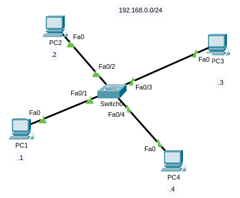

# Virtual Local Area Networks (VLANs)

## What is a VLAN?

VLANs are **logical** grouping of devices in the **same broadcast domain**.

This means VLANs group devices using software (that's what logical means).

## Characteristics

- VLANs are usually configured on switches.
- VLANs can spread across multiple switches. That means broadcasts to a VLAN will be sent to all hosts even if they are not connected to the same switches, hosts only need to be in the same VLAN.

## Why VLANs are used?

- Increase number of broadcast domain. This reduce the amount of traffic since broadcasts are sent to fewer devices.
- Isolate hosts that hold sensitive data.
- Reduce security risks by reducing the number of hosts that receive copies of frames that the switches flood.
- Use VLAN to separate devices logically rather than physical location.
- Reduction of costs, we can reduce the costs that would be needed if each department in an organization needed a physical switch. With a 24 port switch, and 20 users in different departments, we can implement VLANs to separate them without needing additional hardware.
- Administrative tasks improvement, the use of VLANs eases the work IT administrators have to perform to maintain the network. With VLANs, upgrading of the network, troubleshooting and other tasks are made easier.

## Default VLAN

**By default ALL ports belong to VLAN 1**:

```
Switch>
Switch>en
Switch#show vlan brief

VLAN Name                             Status    Ports
---- -------------------------------- --------- -------------------------------
1    default                          active    Fa0/1, Fa0/2, Fa0/3, Fa0/4
                                                Fa0/5, Fa0/6, Fa0/7, Fa0/8
                                                Fa0/9, Fa0/10, Fa0/11, Fa0/12
                                                Fa0/13, Fa0/14, Fa0/15, Fa0/16
                                                Fa0/17, Fa0/18, Fa0/19, Fa0/20
                                                Fa0/21, Fa0/22, Fa0/23, Fa0/24
                                                Gig0/1, Gig0/2
1002 fddi-default                     active    
1003 token-ring-default               active    
1004 fddinet-default                  active    
1005 trnet-default                    active    
Switch#
```

Note VLAN 1002, 1003, 1004 and 1005 are reserved.

**Important**: It is NOT possible to delete VLAN 1:

```
Switch#conf t
Enter configuration commands, one per line.  End with CNTL/Z.
Switch(config)#no vlan 1
Default VLAN 1 may not be deleted
```

## Network without VLANS

In the next lab there's no configuration in the switch which means all hosts belong to the default VLAN 1.



> Download this lab at [vlans___lab_without_config.pkt](https://github.com/noevazz/CCNA_200_301/raw/main/labs/vlans___lab_without_config.pkt)

Let's say Switch0 knows the mac address of all hosts (you can achieve this by pinging all PCs from one PC):

```
Switch>en
Switch#show mac-address-table 
          Mac Address Table
-------------------------------------------

Vlan    Mac Address       Type        Ports
----    -----------       --------    -----

   1    0060.3eca.524d    DYNAMIC     Fa0/4
   1    0060.3ee2.e0e4    DYNAMIC     Fa0/3
   1    0060.5c42.59de    DYNAMIC     Fa0/2
   1    00e0.a37e.8a37    DYNAMIC     Fa0/1

Switch#
```

Now clean the ARP table in all PCs using this command in the Command Prompt:

```
C:\>arp -d
```

> Use `arp -a` to display the ARP table 


With this scenario if PC1 wants to ping PC2, PC1 needs to resolve the mac address of PC2 and for that an ARP request will be sent, ARP asks the switch to send an ARP request to all hosts except for the one that sent the request (PC1 in this case), since all hosts are in the same broadcast domain then PC2, PC3, and PC4 will receive the ARP message.

PC2 will be the only hosts replying with an ARP response. Now the switch can tell PC1 the mac address of PC2, PC1 now can send an ICMP request (ping) with all the information needed.

> You may want to experiment by cleaning the mac address table of the switch and the arp table in the hosts and see what happen in this scenario. For this you can use the following command to clear the mac address table in a switch:

```
Switch#clear mac-address-table

Switch#show mac-address-table
          Mac Address Table
-------------------------------------------

Vlan    Mac Address       Type        Ports
----    -----------       --------    -----

Switch#
```

The same thing will happen with broadcast messages, all hosts within the same broadcast daomain will recieve a copy. Example: DHCP (Dynamic Host Configuration Protocol, used to assing IP addresses atuomatically) uses broadcast and unicast messages to work.


## Network with VLANs

In this lab we are going to create VLAN 10 (For PC1 and PC2) and VLAN 20 for (PC3 and PC4).

Configure VLAN 10:

```
Switch>en
Switch#conf t
Enter configuration commands, one per line.  End with CNTL/Z.
Switch(config)#vlan 10
Switch(config-vlan)#name financial
Switch(config-vlan)
```

Assign FastEthernet0/1 and FastEthernet0/2 to VLAN 10:

```
Switch(config-vlan)#exit
Switch(config)#int f0/1
Switch(config-if)#switchport mode access 
Switch(config-if)#switchport access vlan 10
Switch(config-if)#
Switch(config-if)#int f0/2
Switch(config-if)#switchport mode access 
Switch(config-if)#switchport access vlan 10
Switch(config-if)#
```

> `name` command is optional.

For VLAN 20 we are going to ommit the VLAN creation and we are going to assing VLAN 20 directly on FastEthernet0/3 and FastEthernet0/4:

```
Switch(config-if)#int range f0/3-4
Switch(config-if-range)#switchport mode access 
Switch(config-if-range)#switchport access vlan 20
% Access VLAN does not exist. Creating vlan 20
Switch(config-if-range)#
```

> Note you can use the `interface range` command to configure these ports at the same time, this saves some time and it is the same as doing it individually in each interface.

> Also note VLAN 20 was created on the fly.

> Finally note we did not provide a name for the VLAN (because we did not configure the VLAN manually)

Check the VLAN configuration:

```
Switch(config-if-range)#end
Switch#
%SYS-5-CONFIG_I: Configured from console by console

Switch#show vlan br
Switch#show vlan brief 

VLAN Name                             Status    Ports
---- -------------------------------- --------- -------------------------------
1    default                          active    Fa0/5, Fa0/6, Fa0/7, Fa0/8
                                                Fa0/9, Fa0/10, Fa0/11, Fa0/12
                                                Fa0/13, Fa0/14, Fa0/15, Fa0/16
                                                Fa0/17, Fa0/18, Fa0/19, Fa0/20
                                                Fa0/21, Fa0/22, Fa0/23, Fa0/24
                                                Gig0/1, Gig0/2
10   financial                        active    Fa0/1, Fa0/2
20   VLAN0020                         active    Fa0/3, Fa0/4
1002 fddi-default                     active    
1003 token-ring-default               active    
1004 fddinet-default                  active    
1005 trnet-default                    active    
Switch#
```

> Note VLAN 10 and 20 are displayed along with its interfaces.

> Also note VLAN 20 recieved the name "VLAN0020", this is the default format when you do not provide a name (or when a VLAN is created automatically).

Now there are 2 broadcast domains. Run the same steps as in the previous lab (make sure to clear the ARP table on all hosts and verify the switch has its macc address table complete):

- With this escenario you will notice how the ARP request is only send to one PC (it will be send for all devices in the same VLAN, this lab only have 2 PCs per VLAN, add more if you want to experiment)

Download this lab with the configuration at: [vlans___lab_with_config.pkt](https://github.com/noevazz/CCNA_200_301/raw/main/labs/vlans___lab_with_config.pkt)


## Trunks

A trunk is a point-to-point link between two switches. This link allows traffic from many VLANs to move between the switches.

When configuring trunk ports it is important to know these other concepts:

- **Native VLAN**: This is the port that the switch uses to send untagged traffic. Tagged traffic is all traffic destined to a particular VLAN. Untagged traffic may be any traffic which is not destined to any particular VLAN such as control information.
- **Dynamic trunk protocol**: DTP is a CISCO proprietary protocol that negotiates the trunking modes between switches.


## Port security


## External resources

1. [En] [https://study-ccna.com/what-is-a-vlan/](https://study-ccna.com/what-is-a-vlan/)
2. [En] [https://www.ccnablog.com/vlans-part-i/](https://www.ccnablog.com/vlans-part-i/)
