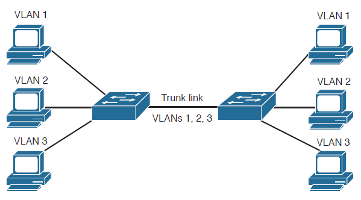
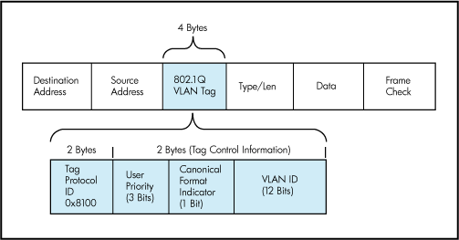
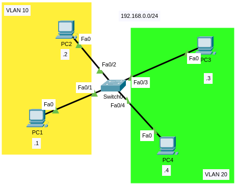
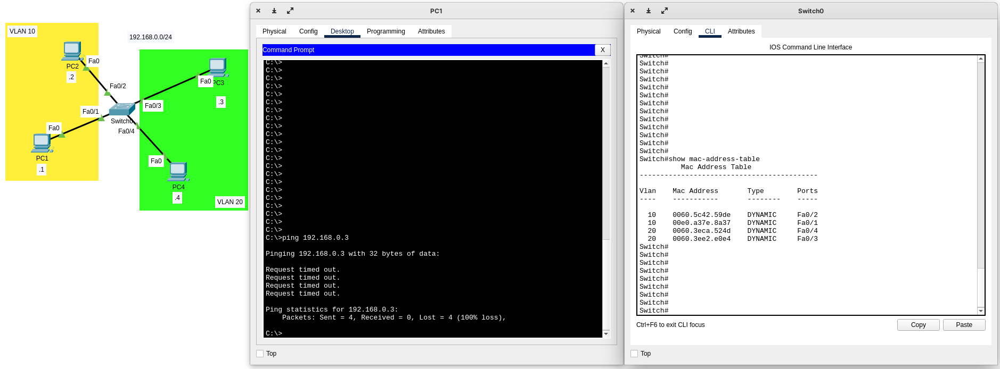

# Virtual Local Area Networks (VLANs)

## What is a VLAN?

VLANs are **logical** grouping of devices in the **same broadcast domain** (another word for this is "segmentation").

This means VLANs group devices using software (that's what logical means).

## Characteristics

- VLANs are usually configured on switches.
- Interfaces in a switch are configured to be part of one VLAN.
- VLANs can spread across multiple switches. That means broadcasts to a VLAN will be sent to all hosts even if they are not connected to the same switches, hosts only need to be in the same VLAN.

## Why VLANs are used?

- Increase number of broadcast domain. This reduce the amount of traffic since broadcasts are sent to fewer devices.
- Isolate hosts that hold sensitive data.
- Reduce security risks by reducing the number of hosts that receive copies of frames that the switches flood.
- Use VLAN to separate devices logically rather than physical location.
- Reduction of costs, we can reduce the costs that would be needed if each department in an organization needed a physical switch. With a 24 port switch, and 20 users in different departments, we can implement VLANs to separate them without needing additional hardware.
- Administrative tasks improvement, the use of VLANs eases the work IT administrators have to perform to maintain the network. With VLANs, upgrading of the network, troubleshooting and other tasks are made easier.

## VLAN Types

- **Data Vlan**: Used for user-generated traffic. Data VLAN is often reffered to as user VLAN.
- **Default VLAN**: Interfaces in a switch are place as part of one VLAN, by default all interfaces belongs to VLAN 1 (default VLAN).
- **Native VLAN**: A link that carries multiple VLANs between two switches is called **trunk link**. A native VLAN is the VLAN used in a trunk link to send traffic that does not come from a VLAN (untagged traffic), by default native VLAN is VLAN 1.
- **Voice VLAN**: It is a VLAN that supports Voice over IP (VoIP), this VLAN ensures:
    - Bandwidth for voice quality
    - Quality of Services (QoS): voice traffic has higher priority over other types of network traffic.
    - Delay less than 150 ms across network-
    - Ability to be routed around congested areas on the network.

Please remember that a trunk link is a link between two switches that is able to carry traffic from multiple VLANS:



> In the image above you can see a label above each PC, this means that the interface in the switch belongs to a VLAN. The interface in the PC does NOT know anything about VLANs, it is the interface in the switch that has this intelligence. The label of the VLAN is place above the PCs just for better visualization.

## VLAN tagging

VLANs are identified by a 12 bits number (in practice we use the decimal format), this number is called VLAN ID (**VID**).

With 12 bits we have 4096 decimal numbers from 0 to 4095

The standard Ethernet frame header does **NOT** contain information about the VLAN to which the frame belongs.

When Ethernet frames are placed on a trunk link, information about the VLAN is added. This process is called tagging, and it is accomplished using the IEEE 802.1Q standard (aka dot1q).

The 802.1Q standard defines a header (802.1Q header) that includes a **4-byte** tag inserted within the original Ethernet frame specifying the VLAN:



**IMPORTANT**: When a switch receives a frame on a port configured in access mode (more about this later) and assigned a VLAN, the switch inserts a VLAN tag in the frame, recalculates the Frame Check Sequence (FCS) and sends the tagged frame out of a trunk port.

VLAN tag fields:
- **Type**: also called tag protocol ID (**TPID**), For Ethernet is is set to hexadecimal value of 0x8100.
- **User priority**: Used for level or service implementation.
- **Canonical Format Indicator (CFI)**: Enables Token Ring frames to be carried across Ethernet Links.
- **VLAN ID**: The actual identifier.

## Reserved VIDs (VLAN IDs)

There are some reserved VIDs:
- VLAN 0: Indicates that the frame does not carry any VLAN ID.
- VLAN 4095: This ID is used for implementation use; it must be configured or transmitted. It can, for example, be used to indicate a wildcard match in management operations or filtering database entries.
- VLAN 1002, 1003, 1004 and 1005: These are reserved for Fiber Distributed Data Interface (FDDI) and Token Ring. These VLANS have been kept for legacy compatibility.

## VLAN ranges

- Normal range
    - For small and medium-sized networks.
    - From VLAN 1 to VLAN 1005 (VLAN 1, 1002, 1003, 1004, and 1005 are automatically created and cannot be removed).
    - Configuration for this range is stored in **flash memory** in a database file called vlan.dat.
    - VLAN Trunking Protocol (VTP) can only learn and store normal range VLANS (VTP is a feature to help manage VLAN configuration).

- Extended range
    - Used by global enterprises that are large enough to need extended range.
    - From VLAN 1006 to 4094.
    - Configuration is saved in **running configuration** by default NOT in vlan.dat file.
    - Support fewer VLAN features than normal range.
    - VTP does not learn extended range VLANs.

## Default VLAN

**By default ALL ports belong to VLAN 1**:

```
Switch>
Switch>en
Switch#show vlan brief

VLAN Name                             Status    Ports
---- -------------------------------- --------- -------------------------------
1    default                          active    Fa0/1, Fa0/2, Fa0/3, Fa0/4
                                                Fa0/5, Fa0/6, Fa0/7, Fa0/8
                                                Fa0/9, Fa0/10, Fa0/11, Fa0/12
                                                Fa0/13, Fa0/14, Fa0/15, Fa0/16
                                                Fa0/17, Fa0/18, Fa0/19, Fa0/20
                                                Fa0/21, Fa0/22, Fa0/23, Fa0/24
                                                Gig0/1, Gig0/2
1002 fddi-default                     active    
1003 token-ring-default               active    
1004 fddinet-default                  active    
1005 trnet-default                    active    
Switch#
```

> VLAN 1002, 1003, 1004 and 1005 are reserved.

**Important**: It is NOT possible to delete VLAN 1:

```
Switch#conf t
Enter configuration commands, one per line.  End with CNTL/Z.
Switch(config)#no vlan 1
Default VLAN 1 may not be deleted
```


## Network without VLANS configured

In the next lab:
- PC1 will ping PC2.
- There's no configuration in the switch which means all hosts belong to the default VLAN 1.
- Only PCs has a static IP address (This was done in Desktop>IP Configuration).


Download this lab at [https://github.com/noevazz/CCNA_200_301/raw/main/labs/vlans___lab_without_config.pkt](https://github.com/noevazz/CCNA_200_301/raw/main/labs/vlans___lab_without_config.pkt)

Let's start by removoving all entries from the ARP table in PC1 and PC2 and remove all entries in the MAC address table in Switch0:


Useful commands:
- Clear the ARP table in all PCs using the `arp -d` command (when clearing the ARP table a packet is send to the Switch and it will populate its MAC address table, for that reason FIRST clear the ARP tables in the PCs before clearing the MAC address table in Switch0).
- Use `arp -a` to display the ARP table in al PCs
- Use the `show mac-address-table` command to **SHOW** the mac address table in Switch0.
- Use the `clear mac-address-table` command to **CLEAR** the mac address table in Switch0.

> **To remember**: MAC address table maps ports with MAC addresses, and ARP table maps IP addresses with MAC addresses.

With this scenario if PC1 wants to ping PC2, PC1 needs to resolve the mac address of PC2 and for that an ARP request will be sent, ARP asks the switch to send an ARP request to all hosts except for the one that sent the request (PC1 in this case), since all hosts are in the same broadcast domain then PC2, PC3, and PC4 will receive the ARP message:


> Note: When Switch0 receives the ARP request of PC1 it now knows the mac address of PC1, Switch0 will add that mac address to its mac address table.\
> When PC2 receive the ARP request it will know the IP and MAC address of PC1 therefore PC2 will add this info to its ARP table.

PC3 and PC4 will discard the packet and PC2 will be the only host replying with an ARP response, this response is forwarded from the switch to PC1:


> When Switch0 receives the ARP response of PC2 it now knows the mac address of PC2, Switch0 will add that mac address to its mac address table.\
> Once PC1 receives the packet forwarded by Switch0 PC1 will add the MAC address and IP address of PC2 to its ARP table.

Now PC1 knows the mac address of PC2, PC1 now can send an ICMP requests (ping) with all the information needed to PC2:


> Note 4 ICMP packets are sent by default.

What if PC1 and PC2 know the mac address of each other but Switch0 does not have any information in its mac address table?, **When a switch doesn't have the destination mac address in its mac address table, it floods the frame (packet in this case because it is an ICMP message) to all other port except the receiving port**. At this point of the lab you can try this by clearing the mac address table of Switch0 and run the same steps again:


> Note how Switch0 flooded the packet to all PCs then PC2 replied and at that moment Switch0 was able to know the mac address of PC2. Next packets were sent directly from PC1 to PC2.


The same thing will happen with **broadcast** messages, all hosts within the same broadcast domain will receive a copy. Example: DHCP (Dynamic Host Configuration Protocol, used to assign IP addresses automatically) uses broadcast and unicast messages to work.


## Network with VLANs

We already know how ARP works.

In this lab we are going to create VLAN 10 (For PC1 and PC2) and VLAN 20 for (PC3 and PC4) in Switch0:

- Create VLAN 10:

```
Switch>en
Switch#conf t
Enter configuration commands, one per line.  End with CNTL/Z.
Switch(config)#vlan 10
Switch(config-vlan)#name financial
Switch(config-vlan)
```

> `name` command is optional.

> You can delete a VLAN with the `no vlan <vid>` global configuration command.

- Assign FastEthernet0/1 and FastEthernet0/2 to VLAN 10:

```
Switch(config-vlan)#exit
Switch(config)#int f0/1
Switch(config-if)#switchport mode access 
Switch(config-if)#switchport access vlan 10
Switch(config-if)#
Switch(config-if)#int f0/2
Switch(config-if)#switchport mode access 
Switch(config-if)#switchport access vlan 10
Switch(config-if)#
```

For VLAN 20 we are going to ommit the VLAN creation and we are going to assing VLAN 20 directly on FastEthernet0/3 and FastEthernet0/4:

```
Switch(config-if)#int range f0/3-4
Switch(config-if-range)#switchport mode access 
Switch(config-if-range)#switchport access vlan 20
% Access VLAN does not exist. Creating vlan 20    <-- ATTENTION TO THIS MESSAGE
Switch(config-if-range)#
```

> Note you can use the `interface range` command to configure these ports at the same time, this saves some time and it is the same as doing it individually in each interface.

> Also note VLAN 20 was created on the fly so we did not provide a name for this VLAN.


**Access mode** is used for these interfaces because Access ports are part of only one VLAN and normally used for terminating end devices like PCs, laptops, printers, etc. *(We will explore more about switchport modes in the DTP section).*

Now let's check the VLAN configuration:

```
Switch(config-if-range)#end
Switch#
%SYS-5-CONFIG_I: Configured from console by console

Switch#show vlan br
Switch#show vlan brief 

VLAN Name                             Status    Ports
---- -------------------------------- --------- -------------------------------
1    default                          active    Fa0/5, Fa0/6, Fa0/7, Fa0/8
                                                Fa0/9, Fa0/10, Fa0/11, Fa0/12
                                                Fa0/13, Fa0/14, Fa0/15, Fa0/16
                                                Fa0/17, Fa0/18, Fa0/19, Fa0/20
                                                Fa0/21, Fa0/22, Fa0/23, Fa0/24
                                                Gig0/1, Gig0/2
10   financial                        active    Fa0/1, Fa0/2
20   VLAN0020                         active    Fa0/3, Fa0/4
1002 fddi-default                     active    
1003 token-ring-default               active    
1004 fddinet-default                  active    
1005 trnet-default                    active    
Switch#
```

> Note VLAN 10 and 20 are displayed along with its interfaces.

> Also note VLAN 20 received the name "VLAN0020", this is the default format when you do not provide a name (or when a VLAN is created automatically).

Now there are 2 broadcast domains:



**I have cleared the MAC address table in Switch0 and cleared the ARP table in all PCs.**

Let's ping PC2 from PC1:


> When using the envelope icon it will send only one ICMP message (not 4 as `ping` does)

- Note how Switch0 only sends ARP request to PC2 (green envelopes), after the ARP process is completed PC1 sends the ICMP packet (brown envelope).

Download this lab with the configuration at: [https://github.com/noevazz/CCNA_200_301/raw/main/labs/vlans___lab_with_config.pkt](https://github.com/noevazz/CCNA_200_301/raw/main/labs/vlans___lab_with_config.pkt)

## Communication between different VLANs

What if PC1 wants to communicate with PC3?. Both are in different VLANs.

As we know, VLANs are used to segment the network in multiple broadcast domains. These segments are treated as different networks. We require a layer 3 device to interconnect different networks, with our current lab we cannot stablish communication between different VLANS:



In the image above you can see PC1 cannot issue a ping to PC3.

> Note: I have populated the MAC address table in Switch 0 by pinging from PC1 to PC2 and from PC3 to PC4 and vice versa.

We can resolve this issue by adding a router (a layer 3 device) connected to the switch and doing the proper configuration. We are going to hold that lab for now as we are going to see how to connect multiple switches and configure trunk links.

## Key takeaways

|command           |Description                           |Example                                |
|------------------|--------------------------------------|---------------------------------------|
|`vlan <vid>`      |Create a VLAN                         |`SW(config)# vlan 200`                 |
|`name <VLAN name>`|Name a VLAN (used after vlan creation)|`SW(config-vlan)# name vlanforstudents`|

## External resources

1. [En] [https://study-ccna.com/what-is-a-vlan/](https://study-ccna.com/what-is-a-vlan/)
2. [En] [https://www.ccnablog.com/vlans-part-i/](https://www.ccnablog.com/vlans-part-i/)
3. [En] [https://ipwithease.com/switchport-trunk-mode-vs-access-mode/](https://ipwithease.com/switchport-trunk-mode-vs-access-mode/)

## NEXT SECTION
[Switch trunks and DTP](./switch_trunks_and_DTP.md)