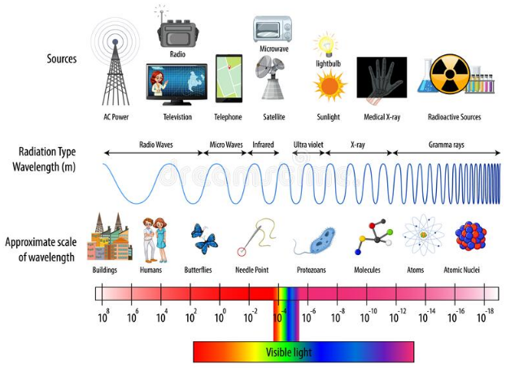

# Wireless Principles

## What is a wave?

In physics, the word "wave" is used to designate the transmission (**propagation**) of energy from the place where it was created. It is a **disturbance** or shake that moves in a certain environment and after passing it leaves matter it in its initial state.

> **⭐ When studying waves it's important to remember that they transfer energy, NOT matter. ⭐**

## What is energy

Energy, a measure of the ability to do work, comes in many forms and can transform from one type to another.

Examples of stored or potential energy include batteries and water behind a dam. Objects in motion are examples of kinetic energy.

Charged particles—such as electrons and protons—create electromagnetic fields when they move, and these fields transport the type of energy we call **electromagnetic radiation**, or light [3].

## Medium

The substance that a wave moves through is called the **medium**. Examples: Air, water, etc.

## Types of waves based in the medium

- **Mechanical Waves**: These waves requires a medium to propagate. Examples: Sound needs air, it can also travel through water or solids.
    - These waves travel when molecules in the medium collide with each other passing on energy.
- **Electromagnetic Waves**: These waves do NOT need a medium to travel, they can travel through vacuum. Examples: light, microwaves, radio waves, X-rays, etc.
    - They travel through electrical and magnetic fields that are generated by charged particles.

## Types of waves based in the movement

Waves can also be categorized based in the direction that its disturbance is traveling.
- **Transverse waves**: These are waves where the disturbance moves perpendicular to the direction of the wave. Example: a water wave moves up and down as the wave travels.
- **Longitudinal waves**: These are waves where the disturbance moves in the same direction of the wave. Example: in sound waves the molecules collide in the same direction as the wave. 

## Waves properties

- **Amplitude**: Distance from level of crest to level of trough. It is directly related to the amount of energy carried by a wave.
    - Its unit is meters.
- **Period**: Time to complete one cycle.
    - Its unit is seconds.
- **Wavelength**: Distance between identical points in adjacent cycles of crest.
    - It is measured in meters and its symbol is the lambda λ.
- **Frequency**: Number of cycles in 1 second (or in a certain time).
    - Its unit is Hertz (Hz), 1Hz=Once cycle per second.

## More about Electromagnetic waves

These waves are produces due various magnetic and electric fields.

Electricity can be static, like the energy that can make your hair stand on end. 

 Magnetism can also be static, as it is in a refrigerator magnet.

Electromagnetic waves can travel through air and solid materials, and also through the vacuum of space.

Electrical fields and magnetic fields can couple together to form electromagnetic waves.

## Common Frequency Units
|Symbol        |Number          |
|--------------|----------------|
|1 Hz          |1 Hz            |
|1 KHz (K=kilo)|1,000 Hz        |
|1 MHz (M=Mega)|1,000,000 Hz    |
|1 GHz (G=Giga)|1,000,000,000 Hz|

## Electromagnetic spectrum

 The electromagnetic spectrum is the term used by scientists to describe the entire range of light that exists. From radio waves to gamma rays, **most of the light in the universe is, in fact, invisible to us!**

> **📝 Exam topic**: Frequencies between 20 kilohertz (kHz) and 300 gigahertz (GHz) are classified as **radio frequencies (RF)**. RFs transmit data from one device to another device using the air as medium. FM/AM radio, television, DECT phones, and microwave ovens are all operating in the radio frequency range.

The next image shows the RF bands. A band is a speceific range of frequencies.

- VLF = Very Low Frequency
- LF = Low Frequency
- MF = Medium Frequency
- HF = High Frequency
- VHF = Very High Frequency
- SHF = Super High Frequency
- EHF = Extremely High Frequency

## Band vs Channel

A band is a **range of frequency**, it starts from a specific frequency and ends with a specific frequency.

- For example, the HF (High Frequency) band ranges from 3 MHz to 30 MHz .

> You can divide a band into multiple channels.

 A "channel" refers to a portion of a band, it is a fixed width of unspecific frequencies.

 - For example:  a 4 kHz channel doesn't mean that it only passes signals of 4 kHz frequency; it means that the difference between the lowest permissible frequency and the highest permissible frequency within that channel is 4 kHz.

## ISM Band

Industrial, Scientific and Medical Radio Band (ISM Band) refers to a group of radio bands or parts of the radio spectrum that are internationally reserved for the use of radio frequency (RF) energy intended for scientific, medical and industrial requirements rather than for communications. **ISM bands are generally open frequency bands**, which vary according to different regions and permits. 

> ISM bands are also called unlicensed bands.

The 2.4 GHz band is used by WiFi (it also uses 5 GHz), Bluetooth, Zigbee, etc.

## RF in networking

Wireless Networks make use of the RF spectrum to transmit data to a Wireless Access Point (WAP). This WAP allows users (also known as wireless clients) to connect to the network using radio frequencies. Although is wired to the network.

There are 2 major WLAN solutions for WAPs

- Autonomous: Configuration is in each WAP, therefore its operation is independent.
- Lightweight: WAPs are controlled using a Wireless LAN Controller. These are dependent of the controller and configuration and management are done trough the controller.

## Wireless Security Protocols

### Wired Equivalent Privacy (WEP)

With WEP the network admin configured a shared key on the WAP, later this key was configured in each client for authorization.

WEP is no longer recommended because it is easily cracked 

## External resources
1. [En] https://www.ducksters.com/science/physics/waves.php
2. [En] https://openstax.org/books/physics/pages/13-1-types-of-waves
3. [En] https://science.nasa.gov/ems/02_anatomy
4. [En] https://earthsky.org/space/what-is-the-electromagnetic-spectrum/
5. [En] https://terasense.com/terahertz-technology/radio-frequency-bands/
6. [En]  https://www.edaboard.com/threads/what-is-the-difference-between-channel-and-band.259551/
7. [En] https://www.techopedia.com/definition/27785/industrial-scientific-and-medical-radio-band-ism-band
8. [Es] https://radio-waves.orange.com/es/que-es-una-onda/
9. [Es] https://www.aprendiendoarduino.com/category/moteino/
